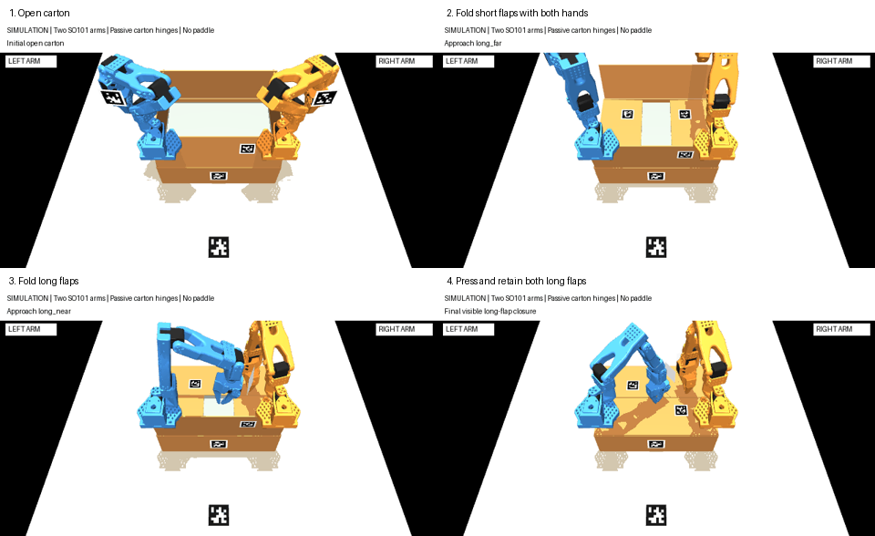

# Two-hand carton folding with AprilTags and depth

**Station correction, 6 October:** the successful layout does not reproduce
the photographed robot/table placement. Its arm bases were 248.5 mm beyond the
table's near edge, over the tabletop, and 260 mm above it. The apparent 40 mm
"setback" was measured from the carton rim, not the table edge. The real side
photo shows the cart behind the table. Read the
[photo review and reach audit](carton-folding-station-audit.md) before reusing
this result. The five passes below remain a hypothetical contact baseline;
they do **not** establish that the current robot can reach and fold the box.

The October 6 simulation closes the measured carton's four top flaps using
both actual SO101 arm models and their bare grippers. The working approach is
a geometric RGB-D controller. **This is not a trained MolmoAct2 box policy or
a physical robot result.** The earlier Molmo research remains useful for a
later learned-policy comparison against this working contact baseline.



## Historical result in the favorable layout

At 640×360, five operating cases passed: nominal, two translated/rotated carton
placements, heavier depth noise/dropout, and a moderately stiffer crease. Each
case required all four flaps to remain within **5 degrees of horizontal for
an entire two simulated seconds**, with the left fingers contacting the left
short and near long flaps and the right fingers contacting the right short and
far long flaps. Both short flaps were supported by the simulated contents.

| Independent measurement | Nominal result |
| --- | --- |
| Short left / short right | 91.843° / 91.843° folded from upright |
| Far long / near long | 90.290° / 90.324° |
| Largest robot/table, robot/wall or robot/robot penetration | 0 mm |
| Largest final contact penetration, including carton contacts | 0.164 mm |
| Initial tag/depth carton-position error | 2.980 mm |
| Carton translation during folding | 0.048 mm |
| Real motor commands | 0 |

Six negative controls failed to claim a fold: missing tags, missing depth,
a stuck far flap, disabled right arm, no actions, and an incorrect gripper
registration. A separate strong-springback case also failed: the short flaps
reopened to about 63° after withdrawal. That remains a material limitation,
not an accepted success. These small, deliberately selected trials are not
an estimate of physical reliability.

Across passing cases, initial carton-position error reached 6.98 mm and the
gripper tag/encoder-FK discrepancy reached 9.77 mm. Successful contact under
these errors does not certify millimetre-accurate physical positioning.

Full results, source hashes, parameters and paths are in the checked-in
[evidence](evidence/bimanual-folding-rgbd-simulation.json). The 93 relevant unit
and existing tag tests pass in addition to the twelve physics trials.

## What runs end to end

1. MuJoCo renders RGB and optical-axis depth from the same fixed camera state.
   Depth receives Gaussian noise and missing pixels before perception sees it.
2. The existing production `farm.perception.tags.detect_tags` detects real
   rasterized tag36h11 patterns. Robust depth planes and decoded corners recover
   metric poses. Fresh table and carton tags are required; stale sequences,
   unaligned depth and unsynchronized observations are refused.
3. Surveyed table tag 1 establishes the camera-to-robot/world frame. The first
   observation checks housing tags 2 and 4 against encoder FK and declared
   rigid mount offsets. These housing checks are not an automatic hand-eye fit.
4. Tag 10 and depth locate the carton. Flap tags and visible cardboard depth
   planes supply fold progress. Temporal association prevents a folded panel
   from being mistaken for a different upright panel. Covered short flaps are
   checked before long flaps cover them.
5. A coordinated controller folds both short flaps, then far and near long
   flaps, and finally presses both long flaps together to retain the shorts.
   Robot-only IK includes a multistart fallback; actual fingertip tracking and
   collision checks can reject a requested movement.
6. Only twelve robot joint actuators move. Carton hinges are passive, the carton
   base is free, and contact physics moves the panels. Simulator flap angles,
   object positions and contacts are confined to the independent evaluator.
   They are never supplied to the visual controller as observations or targets.

This explicitly separates a visual completion estimate from a physical-state
score. A controller report alone cannot pass the simulation.

## Station and material assumptions

The real station must be measured before transferring any of this setup.

- Measured carton CAD dimensions: 379×283×108 mm; four 140 mm flaps.
- Arm bases: 300 mm apart, **260 mm above the tabletop**, with the base line
  40 mm behind the near rim. The table near edge is at y=-430 mm while the base
  line is at y=-181.5 mm: bases are 248.5 mm over the tabletop. This was not
  measured from the photographed cart/table station.
  The real arm chains, mesh geometry and joint limits are retained. The robot
  cart body is not modeled, so this is not cart/table collision validation.
- The carton represents a filled box: contents are approximated by one rigid
  0.96 kg volume whose top is 102 mm above the table. Actual contents geometry,
  fill height and compliance remain unmeasured.
- Each panel has 23 g mass; crease friction is 0.004 Nm. Stiffness 0.008 and
  0.012 Nm/rad passed; 0.018 Nm/rad did not. No plastic deformation or realistic
  corrugated-cardboard bending is simulated.
- The camera is an assumed rectified RGB-D sensor with a 48° vertical field of
  view, 640×360 output and exactly synchronized streams. Standard noise is
  0.8 mm with 25% pixel dropout; the stress trial uses 1.5 mm and 45%. This is
  not a simulation of OAK stereo matching, systematic depth bias or all
  real missing-depth patterns. The OAK's factory intrinsics must replace the
  assumed intrinsics for physical use.
- Registered table/base transforms and marker offsets are exact declared
  simulation geometry. A real installation still needs measured tag sizes,
  both base registrations, both fingertip offsets and housing mount checks.
- Both hands remain in the final retaining pose. Taping and hands-free release
  retention are separate tasks and are not claimed here.

A model-audit correction mattered: MuJoCo normally filters parent/child
collisions. The final model explicitly enables flap/contents pairs and lets
hinges rotate to about 175°, so an artificial stop at 90° cannot hold the box
closed. The original narrow-stop experiments are retained as superseded local
diagnostics. See [MuJoCo collision filtering](https://mujoco.readthedocs.io/en/stable/computation/#collision-detection).

## Marker setup used in the simulation

This adds markers beyond the existing table/gripper/paddle kit. It does **not**
mean the user's current physical markers already match the simulated setup.

| ID | Black-square width | Mount |
| --- | --- | --- |
| 1 | 60 mm | Surveyed tabletop anchor |
| 2 | 40 mm | Right fixed gripper housing |
| 4 | 40 mm | Left fixed gripper housing |
| 10 | 45 mm | Centre of the carton's near wall, at half wall height |
| 11 / 12 | 35 mm | Outside of left/right short flaps, 90 mm above hinge and 70 mm toward the far side along hinge |
| 13 | 35 mm | Outside of far long flap, 90 mm above hinge, 80 mm left of centre |
| 14 | 35 mm | Outside of near long flap, 90 mm above hinge, 80 mm right of centre |

Flap markers face upward when folded and are offset from planned finger contacts.
ID 3, the paddle marker, is unused. A hidden flap marker is not treated as a
closed flap; visible depth can estimate a panel angle, or the controller stops
when it lacks the required evidence.

## Reproduce

Use the existing `gemma-xlerobot` source assets, including
`scene-assets/arm-import.xml`, its mesh files, and `scene-assets/jaw-collision/`.
These are the same real SO101 assets used by the previous paddle simulator.
They remain external local assets; the repository does not silently download
or replace them. Run with a new output directory to preserve earlier evidence.

```sh
cd /path/to/xlerobot-farm/software
python -m pip install -r requirements-carton-folding-sim.txt
PYTHONPATH=. python tools/simulate_bimanual_folding.py \
  --simulation-root /absolute/path/to/gemma-xlerobot \
  --out /absolute/path/to/new-fold-run --reference-layout

# Five operating cases, six failure controls, one known material limit.
PYTHONPATH=. python tools/evaluate_bimanual_folding.py \
  --simulation-root /absolute/path/to/gemma-xlerobot \
  --out /absolute/path/to/new-fold-matrix --reference-layout
```

There is no implicit favorable station default. For a different hypothetical
station, supply `--base-height`, `--base-to-table-edge`, and
`--box-from-table-edge` in metres instead of `--reference-layout`.
These explicit values still do not constitute measured physical registration.

The tools have no serial transport or hardware camera backend. They save the
MJCF scene, observation history, contact/angle traces, code hashes, independent
score, initial/final PNGs and a labeled GIF. A matrix command returns nonzero
if a case differs from its declared expected result. Inspect individual
`success` values: expected failures are never relabeled successful folds.

## Reuse for MolmoAct2

`carton/folding_controller.py` is a task-level baseline with a sensor/control
port; it has no simulator import. `folding_vision.py` handles measured inputs.
The simulator supplies the two SO101 arms and a reproducible contact task.
Reuse these for demonstration collection and evaluation while adapting a
properly normalized twelve-channel bimanual policy. No Molmo weights were
trained or changed for this result, and the other chat's active experiment
was not modified.
