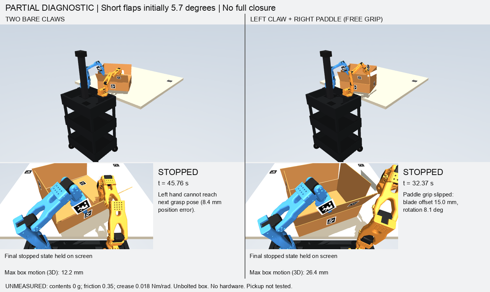

# Corrected free-carton and resistant-flap simulations

**Neither variant has completed four-flap folding and hands-off retention.**
No hardware was accessed. The empty carton remains a free body; the paddle
also remains a free body held by contact. There are no box clamps, tool welds,
hidden flap actuators, added contents or automatic tape constraints.

## Physics and initial-state corrections

The previous all-inward initial pose intersected neighboring rigid flap panels
by about 11 mm before the first physics step. That invalidates the earlier
ordinary comparisons, including their favorable loaded-box success claim.
`initialize_flaps` now checks intersections and refuses that pose. The default
starts short flaps 5.73 degrees inward and long flaps 5.73 degrees outward.
This changes the starting pose, not the hinges' rest angles or resistance.

The matched runs use an empty 272 g carton, table friction 0.35, hinge
stiffness 0.018 Nm/rad, hinge friction 0.004 Nm and damping 0.008 Nms/rad.
Hinges tend toward upright and generate 0.0283 Nm of spring moment at 90
degrees. All are unmeasured assumptions. Panels are rigid; bending and
permanent crease deformation are not modeled. The user's real flap springback
still needs to be characterized before these values can be called accurate.

Regression controls confirm that the carton slides under a push and the empty
folded carton springs open after release. They check both numerical solver
configurations below and verify unchanged mass, friction, joint travel and
actuator torque limits. The robot retains its original 12 actuators, 2.94 Nm
arm limits, 0.5 Nm jaw limits, 8 mm IK gate, 35 mm tracking gate and 1 mm
forbidden-contact gate.

## Grip solver sensitivity

MuJoCo's regularized contact model can creep even when the required force lies
inside the friction cone. Its documented remedies are higher `impratio` and,
when needed, a few NoSlip friction iterations. This is a numerical setting,
not an increased friction coefficient or a grasp weld. See
[MuJoCo's slip guidance](https://mujoco.readthedocs.io/en/stable/modeling.html#preventing-slip).

With identical 30 g paddle, grip geometry, friction 0.8 and motor limits:

| Stationary gravity-hold control | Result |
|---|---|
| `impratio=1`, no NoSlip | 15 mm slip limit at 0.442 s |
| `impratio=10`, no NoSlip | Limit at 4.318 s |
| `impratio=50`, no NoSlip | Limit at 21.522 s |
| `impratio=10`, 3 NoSlip iterations | Holds for 30 s; maximum blade error 6.845 mm |
| Same, timestep halved to 1 ms | Holds for 30 s; maximum blade error 6.845 mm |
| Same solver, zero grip friction | Fails at 0.056 s |

The matched bracing runs use the fourth configuration for **both** variants.
Newton tolerance is 1e-10; timestep is 2 ms. The generic runner retains its
legacy solver by default; `--solver friction` selects this declared experiment.
Actual options are recorded in every physics report. NoSlip is not proof of a
real grip and can affect complex contact dynamics; the paddle still slips
during the folding attempt. Original slip gates remain enabled.

## Contact and perception changes

A new diagnostic pinches the near flap at its top edge, opens it outward
about 30 degrees and keeps that hand in a fixed world pose while the other
folds the right short flap. This avoids chasing box movement with the bracing
hand. Grasp evidence requires loaded contacts on opposite broad faces of the
intended panel. Two jaws merely touching the panel edge do not count.

Closing the pinched flap then attempts a rotation about the visually located
hinge, starting at the encoder-derived gripper pose. The stronger face-normal
IK objective exposes unreachable poses instead of allowing large orientation
error to twist the box. These contact checks and collision-planning snapshots
use simulator truth for independent diagnostics; they are not physical sensing
or a deployable robot motion adapter.

The proposed external camera is at (-0.40, -0.45, 0.85) m in the simulation's
table frame, aimed at (0, 0.075, 0.13) m. Original rear-cart geometry stays
unchanged. Fresh side-wall tags 21/22 supplement front-wall tag 10, all with
45 mm black squares. No stale carton pose is accepted; inconsistent fresh
markers are rejected. RGB-D timing, table-anchor and housing-tag checks remain.
These side tags and this camera mount are **not verified on the real setup**.
The simulation still requires aligned depth.

Three rendered registration probes, with 0.8 mm depth noise and 25% missing
pixels, recovered carton position within 1.50–2.91 mm and orientation within
0.50 degrees. This checks the new side-tag geometry in rendered images only.

## Complete attempt results



| Variant | Progress and failure | Maximum box movement |
|---|---|---|
| Two bare claws | Opens and pinches the near flap, then holds the right short flap at 85.81 degrees. Closing the near flap stops at 45.764 s because the next grasp-preserving pose misses by 8.4 mm, beyond the existing 8 mm gate. | 5.10 mm through the short-flap hold; 12.19 mm over the full attempt. Box stays on the table. |
| Left claw and right paddle | Same near-flap opening succeeds. During right-hand contact the tool reaches its 15 mm grip-slip limit at 32.366 s, before completing the short fold. | 26.45 mm; one bottom corner reaches 0.58 mm beyond the table edge. |

The short flap in the claw trial ends at 91.76 degrees while still contacted,
but the other three flaps are not closed. This is partial bracing progress,
not a four-flap or retention pass. The paddle's stationary hold did not predict
success under folding contact load. Both reports set full-task success false.
All 65 focused folding tests passed; those tests do not establish task success.

## Reproduce and inspect

From `software`, use fresh output directories for each command:

```sh
PYTHONPATH=. .venv/bin/python tools/diagnose_braced_folding.py \
  --simulation-root /absolute/path/to/gemma-xlerobot \
  --out /absolute/path/to/review/braced-claws --tool claws --video

PYTHONPATH=. .venv/bin/python tools/diagnose_braced_folding.py \
  --simulation-root /absolute/path/to/gemma-xlerobot \
  --out /absolute/path/to/review/braced-paddle --tool paddle --video

PYTHONPATH=. .venv/bin/python tools/render_folding_comparison.py \
  --comparison /absolute/path/to/review --case braced

PYTHONPATH=. .venv/bin/python tools/verify_folding_grip_solver.py \
  --simulation-root /absolute/path/to/gemma-xlerobot \
  --out /absolute/path/to/new-solver-controls
```

The renderer supplies the complete combined timeline and a complete separate
GIF for each attempt, with the whole cart, close view, stop reason and a
2.5-second final-state hold. A stopped run is not animated into a success.

[Machine-readable evidence](evidence/carton-braced-folding-progress.json)
includes stage angles, box movement, source hashes and solver controls.
Next work is a reachable grasp transition or regrasp and a paddle contact path
that retains the tool under load, followed by all remaining folds and explicit
retention after withdrawal. Tape application has not yet been simulated.
