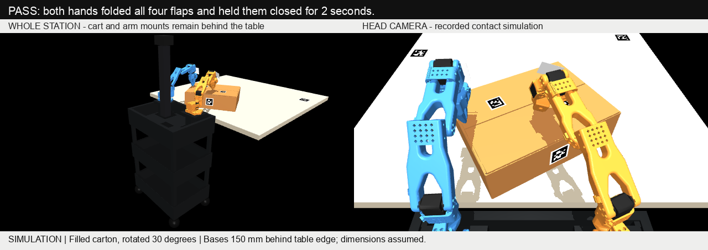

# Four-flap folding with the cart behind the table

**Initial-state correction:** an audit found adjacent flap panels intersecting
by about 11 mm in the all-inward start used by the earlier folding runs.
The historical passes below are unvalidated and must not be cited as folding
success. The corrected empty, resistant, freely moving carton still has no
complete success; see the [current audit](carton-braced-folding-audit.md).

**Material update:** the [free-box and springback audit](carton-free-box-springback.md) now tests empty/load/friction/crease variations and hands-off retention. The passes below used the loaded, weak-crease assumptions and do not demonstrate closure of a loose resistant carton.

The corrected **offline simulation** passes with both arm mounts behind the
table. The box is rotated 30 degrees: the left hand folds the left short flap
and the far flap near its left corner; the right hand folds the right short
flap and the near flap. The near flap closes first so the right hand retains
it while the left hand reaches the far corner. These contact points require
less reach than the middle of the far flap.



## Evidence and limits

- Nominal and two sideways box shifts (+5 mm and -5 mm) pass. Final nominal
  hinge angles are 91.843, 91.843, 90.315 and 90.302 degrees from upright.
  Every flap stays within 85–95 degrees at every 2 ms physics step throughout
  the final two-second hold. Both hands actually contact their assigned flaps.
- The only actuators are the twelve arm/gripper joints. The box is free and
  flap hinges are passive; no 90-degree stops or flap actuators hold it closed.
- Robot/cart, robot/table, robot/rigid-box and robot/robot penetration is 0 mm
  in the nominal run. The unchanged stop threshold is 1 mm; IK error remains
  limited to 8 mm and actual fingertip target error to 35 mm.
- Six negative controls reject success: missing tags, missing depth, disabled
  right arm, no actions, wrong gripper registration and a stuck far flap.
- A trial with 1.5 mm depth noise and 45% dropout **fails**: the left short flap
  is pushed outward and visual closure is refused. Nominal noise is 0.8 mm
  with 25% dropout. These trials are not a physical success-rate estimate.
- The model is a **filled carton**, with a rigid 0.96 kg contents volume whose
  top supports the short flaps. Empty-carton folding is unvalidated. Hands
  remain in the final holding pose; taping and unsupported release are separate.
- The photos show white fingertip attachments. Their exact design and mount
  remain unconfirmed; this simulation uses the stock rigid SO101 fingertips.
  It is not a photo-calibrated digital twin or a learned MolmoAct2 policy.

Full parameters, code hashes, hold extrema, contacts, failures and local GIF
path are in [the evidence](evidence/bimanual-folding-rear-cart.json). The rendered
GIF replays recorded simulator joint states, including the entire cart view.
The controller never receives simulated object poses or flap angles directly;
those are used by the independent evaluator only.

The 81 focused folding, station, bimanual, marker and tag-geometry tests pass.
The repository controller reproduces the experimental run's final joint/hinge
state; source snapshots and hashes accompany the final local run.

## Explicit assumed station

| Dimension | Trial value |
| --- | ---: |
| Base origin height above tabletop | 60 mm |
| Base origin line behind near table edge | 150 mm |
| Left/right base origin spacing | 300 mm |
| Cart front to table edge | 35 mm |
| Carton yaw | 30 degrees |
| Carton translation along world Y | 75.792595 mm |
| Nearest carton bottom corner onto table | 10 mm |
| Carton dimensions | 379 x 283 x 108 mm |
| Table dimensions | 1100 x 1100 mm |

All initial carton corners must be supported by the table. Merely rotating
the box without translating it would put a corner beyond the edge and is
refused. Static cart/table overlap is checked separately because static bodies
do not produce normal dynamic contact reports. Cart dimensions and placement
are approximations from the previous simulator, not measured room geometry.

## Camera and tags

Use the original bimanual kit (IDs 1, 2, 4, 10–14) plus a second **60 mm black
square, ID 20**. The [supplemental A4 sheet](assets/bimanual-table-anchor-20-a4.pdf)
preserves its 7.5 mm white border. It was rendered and decoded as ID 20 with
zero bit corrections. Print at 100% and measure the ruler and black square.

Both table tags must be visible initially. The trial assumes their poses are
surveyed relative to the arm bases and the camera remains fixed. Initial
camera registration fits both anchors; later observations require at least
one fresh visible anchor consistent within 6 mm. Moving the camera, losing
both anchors, or losing fresh carton tag 10 stops the sequence. This is not
permission to use a stale marker pose when all anchors disappear.

The model's anchors are at X/Y (-500, 550) and (450, 700) mm in the simulation
frame. **Do not copy those coordinates into hardware without measuring.**
The observed housing tags are checked against encoder FK; they do not fit the
camera transform. Long-flap depth checks use the central gap between the short
flaps so an exposed short flap cannot supply a false long-flap closure.

## Reproduce without hardware

Use the existing local SO101 source assets described in the
[original simulation guide](carton-bimanual-rgbd-simulation.md). No real camera,
serial connection or motor command is used by this tool.

```sh
cd /path/to/xlerobot-farm/software
PYTHONPATH=. python tools/simulate_bimanual_folding.py \
  --simulation-root /absolute/path/to/gemma-xlerobot \
  --out /absolute/path/to/new-diagonal-run \
  --strategy diagonal --base-height .06 --base-to-table-edge .15 \
  --box-from-table-edge .01 --base-spacing .30 \
  --table-tag-x -.50 --table-tag-y .55 \
  --backup-table-tag-x .45 --backup-table-tag-y .70 \
  --yaw 30 --dy .07579259463549806 --width 960 --height 540 \
  --contents-mass .96 --table-friction .7 --stiffness .008
```

Choose a new output path for every run. Add `--dx .005 --seed 17` or
`--dx -.005 --seed 29` for the two passing position trials. Add
`--noise .0015 --dropout .45 --seed 37` to reproduce the known sensor failure.
The `--fault` options reproduce the six negative controls; `--no-video` reduces
output but still runs the same visual controller and contact simulation.

The diagonal controller is geometry-specific. Extending it to the real robot
requires registered base/table/box geometry, identified fingertip CAD and
offsets, measured marker sizes, observed depth quality and real crease/contact
measurements. No physical calibration or deployment is included in this result.
