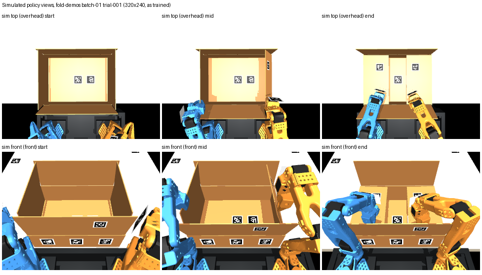

# Fold policy: simulated cameras and station versus the real robot

The short-flap fold policy (ACT, trained on `tools/fold_demos_to_lerobot.py` datasets) sees two
320×240 RGB images, `top` (scene camera `overhead`) and `front` (scene camera `front`), and the 12 arm
joints. On the robot, the images must come from cameras placed and framed like the simulated ones,
over a station shaped like the simulated one, or the simulation must be rebuilt from measurements and
the policy retrained. This page quantifies the gap from saved evidence only (no camera or robot was
accessed) and gives the plan and tools to close it.

**Bottom line.**
- The robot has no camera that could serve as `top`; one has to be added.
- The head camera (OAK-D Lite) can serve as `front`, but not with the stream settings it uses today.
- The station (arm-base height above the tabletop, setback, table) has never been measured and visibly differs.
- Recommended: make the real station match the simulation physically (arm-base height and setback). Then
  measure the two cameras, re-render the 600+ recorded demonstrations with the measured cameras, and
  retrain. Moving a camera in the simulation does not require new demonstrations: the scripted
  controller never looks through `overhead` or `front`, and recordings made with different policy cameras
  are bit-identical.

## 1. What the policy saw in simulation

Source: `/Users/wk/Documents/ChatGPT/Hackatuson/output/fold-demos/batch-01/trial-001/run/scene.xml` (all batch-01/02 trials share these values),
built by `carton/folding_sim.py::build_scene` with `--base-height .12` and the default 150 mm base line
to table edge. Rendered with `tools/render_fold_policy_views.py`; numbers from its `cameras.json`
([copy](img/fold-policy-station-gap/sim-cameras-nominal.json)).



Larger renders: [top start](img/fold-policy-station-gap/sim-top-start-960x720.jpg),
[top end](img/fold-policy-station-gap/sim-top-end-960x720.jpg),
[front start](img/fold-policy-station-gap/sim-front-start-960x720.jpg),
[front end](img/fold-policy-station-gap/sim-front-end-960x720.jpg).
Start, mid and end are samples 0, 277 and 554 (0, 27.7 and 55.4 s). The end sample is where the
conversion cuts the episode, once both shorts have been held folded for 3 s.

**Arm-base frame** (used for every number below and by the measurement file): origin midway between the
two SO101 `base_link` origins, on the base mounting plane; +x is the robot's right, +y points
horizontally toward the table, +z is up; metres. Each `base_link` origin is 38.8 mm behind (−y) the
shoulder-pan axis and 62.4 mm below the shoulder-pan joint (scene FK). On the robot, measure the pan axes
and subtract 38.8 mm.

| | `top` = `overhead` | `front` = `front` |
|---|---|---|
| position (arm-base frame) | (0, +0.3015, +0.73): over the carton centre | (0, −0.080, +0.45): 80 mm behind the base line, centred |
| height above tabletop | 0.85 m | 0.57 m |
| orientation | straight down; image top points away from the robot (+y) | yaw 0, roll 0, pitch 52.1° below horizontal; aimed at (0, +0.2865, −0.02) |
| vertical FOV (`fovy`) | 48° | 48° |
| horizontal FOV at 4:3 | 61.4° | 61.4° |
| intrinsics at 320×240 | fx = fy = 269.5 px, cx = 160, cy = 120 | same |
| tabletop footprint | x ±0.50 m, y −0.08 … +0.68 m (1.0 × 0.76 m) | near edge y = +0.06 m (x ±0.32); far edge y = +0.99 m (x ±0.66) |
| what it shows | carton from above; the near ~0.23 m of the image is the cart and black void beyond the table edge | the whole carton, all four flaps, both forearms and claws, the near carton wall with markers 10/26/27 |

Station in the same frame:
- Tabletop at z = −0.12, near table edge at y = +0.15.
- Carton centre (0, +0.3015); near wall at y = +0.16, 10 mm from the edge; rim at z = −0.012.
- The demonstrations randomise the carton by x −25…+5 mm and yaw ±4°.
- Table 1.1 × 1.1 m, uniform beige (`.70 .66 .58`).
- Arms rendered blue (left) and orange (right).
- About 15 printed AprilTags appear in the images: carton walls 10/21/22/24–28, flaps 11–14, table 1/20, grippers 2/4.
- Flat headlight plus one directional light, no shadows, black background.

## 2. What is known about the real robot

| camera | where | resolution, rate | intrinsics | pose relative to arm bases | source |
|---|---|---|---|---|---|
| OAK-D Lite (RGB + depth) | Head pan/tilt in a printed holder (2026-10-08 phone photo). The slot cradle design is CAD-only as of 13:02 the same day. | 640×360 RGB at 15 fps (aligned depth 640×400 stereo) | fx 504.9, fy 505.0, cx 314.8, cy 192.6. HFOV 64.7°, VFOV 39.2°. Factory 14-coefficient distortion. | Not calibrated (`robot_frame_calibrated: false`, `base_from_oak: null`). 2026-10-05, earlier station: 427 mm from the table plane, optical axis 45° from vertical. 2026-10-08: a near-vertical close-up of bare tabletop. | `/Users/wk/Documents/ChatGPT/Hackatuson/output/gemma-xlerobot/real-scene/measurement.json`, `00-metadata.json`; `/Users/wk/conductor/workspaces/xlerobot-farm/minnetonka/.context/live-oak.jpg`; local branch `RonTuretzky/oak-camera-3d-print-mount` in `/Users/wk/conductor/workspaces/xlerobot-farm/nassau` (`software/parts/head/README.md`) |
| Stock head USB camera | Head tilt link, being replaced by the OAK | 640×480 at 5 fps input | Unknown | Unknown; "aimed high" on 2026-10-04 | `STATUS.md` (2026-10-04 camera notes) |
| Left/right wrist cameras | On each wrist; they move with the arm | 640×480 | Unknown | They move with the arm, so they cannot stand in for a fixed view | `STATUS.md` 2026-10-07 |
| Phone (`phone_overview`) | Hand-placed beside the station | 540×960 portrait (as saved), about 4 fps, receipt timestamps only | Unknown | Unknown | `/Users/wk/conductor/workspaces/xlerobot-farm/minnetonka/.context/live-phone_overview.jpg` |

| station value | simulation | real | confidence | source |
|---|---|---|---|---|
| arm-base plane above the carton's support surface | 120 mm | "Well above the tabletop", not measured. Upstream models disagree: legacy MuJoCo XLeRobot puts the bases 0.775 m above the floor; `docs/carton.md` says shoulders about 0.82 m. | unknown | `/Users/wk/conductor/workspaces/xlerobot-farm/minnetonka/.context/live-phone_overview.jpg`; `docs/carton-sim-training-handoff-2026-10-08.md` caveat 1; `/Users/wk/Documents/ChatGPT/Hackatuson/output/gemma-xlerobot/upstream/assets/robots/xlerobot/xlerobot.xml` |
| base line to near table edge | 150 mm | Not measured; the cart stands beside a small table | unknown | phone photo |
| base spacing | 300 mm | Not measured. Legacy XLeRobot MJCF: 220 mm (±0.11). `docs/carton.md`: "upstream model … 30 cm". | **conflicting, decisive** | same files |
| table | 1.1 × 1.1 m, light beige | Small dark wooden folding table, about 0.6 m wide (estimated from the photo) | low | phone photo |
| head camera above the arm bases | `front` is 0.45 m above and 0.08 m behind | About 0.40 m (legacy MJCF: head camera about 1.18 m above the floor, bases 0.775 m); offset along y unknown | low | `xlerobot.xml` |
| carton markers | 15 printed tags | None on the current carton; tag 2 on the right gripper housing | medium | `STATUS.md` 2026-10-06 |
| arm colour, lighting | blue/orange, flat light, black void | black printed arms, room light, cart, floor and walls in view | high | photos |

Side-by-side sheets with the real images are kept local, because camera imagery is not committed:
- `/Users/wk/Documents/ChatGPT/Hackatuson/output/fold-station-gap/sim-nominal/sheet.png` (real OAK, 2026-10-08)
- `.../fold-station-gap/real-oct05/sheet.png` (real OAK, 2026-10-05, earlier station)

The real `front` today is a close-up of bare wood; there is no real `top` image at all.

### Field of view

The OAK's current 640×360 stream is 16:9. The largest 4:3 crop centred on its principal point is
446×335 px, which gives a vertical FOV of only **36.7°**, narrower than the simulated 48°
(`policy_crop` in `carton/folding_station_measured.py`). The full 4:3 sensor (IMX214) is wider:
about 54° vertical by the Luxonis specification, and at least 50.8° if the horizontal FOV stays 64.7°.
A 4:3 output (for example 640×480 from the full sensor) cropped to 48° would therefore match the
simulation exactly. Read the factory intrinsics for that resolution before relying on this
(`device.readCalibration().getCameraIntrinsics(CAM_A, 640, 480)`, on the robot Mac).

## 3. Which real camera can be which input

- **`front` → head OAK-D Lite.** The simulated `front` is effectively a mast-mounted head camera:
  centred, behind the base line, 0.45 m above the bases, pitched 52° down.
  - Mounting: the real head sits on the mast at roughly that place (low-confidence estimate: 0.40 m above the bases).
    Set the head tilt so the OAK points 52° below horizontal and pan it straight ahead.
  - Stream: switch the RGB stream to 4:3, crop to the measured vertical FOV, resize to 320×240.
  - Measure the actual pose (section 5) and re-render the simulation from it.
  - The stock USB head camera is the fallback. Its intrinsics are unknown and it runs at 5 fps, below the policy's 10 Hz.
- **`top` → a new fixed overhead camera.** Nothing on the robot looks straight down from 0.85 m.
  - Options: the stock head USB camera removed when the OAK goes on the head, or any 4:3 USB webcam.
    Mount it on a tripod, boom or clamp over the carton centre, image top pointing away from the robot.
    Its vertical FOV must be at least 48°, or it must sit higher.
  - Calibrate its intrinsics (checkerboard), then measure its pose.
  - The phone is a last resort: about 4 fps, unknown timing.
- **Wrist cameras:** not usable for this policy (trained on fixed views). Keep them for monitoring.

## 4. Options

Measured pipeline times: recording about 20 min per 300 demonstrations, conversion about 30 min, training about 2 h.

### A. Move/add real cameras and reshape the real station to match the simulation

**For the station geometry, do this.**
- **Arm-base height.** The arm-base plane must sit 120 mm above the surface the carton stands on. If the bases are higher, raise the carton on a
  rigid platform (boards or boxes). Platform size: at least 0.45 m wide and 0.35 m deep, and at least
  10 mm beyond the carton on the near side. Use one matte uniform colour.
  The policy's joint trajectories are tied to this geometry: they put the claws where the carton was in
  simulation. A different height or setback means wrong contact points, whatever the images show.
- **Setback.** Put the cart so the line through the two shoulder-pan axes is 111 mm behind the platform's near
  edge, which is 150 mm from the `base_link` origins. Square the cart to the edge (same distance on both sides).
- **Carton placement.**
  - Near wall 10 mm from the edge.
  - Centre 10 mm left of the midpoint between the arms; the recorded range is −25…+5 mm.
  - Yaw within ±4°.
  - Tape the outline.
- **Base spacing** cannot be changed this way: the arms are bolted to the cart. If it is not 300 mm ±3 mm, use B for the station.

**For the cameras:** placing a camera at exactly the simulated pose by hand is within a few centimetres
and degrees at best. The head mast also fixes `front` near, not at, (0, −0.08, 0.45). Use A only to get
close: overhead camera about 0.85 m above the table over the carton centre, head tilted to 52°. Then
measure and use B.

**Payoff:** the existing trained policy (`act-v1`) could be tried without retraining, but only if both
cameras land within about 1 cm and 1° of the simulated poses and the image appearance gap (section 6) is
acceptable. Unlikely.

**Cost:** owner 2–4 h for platform, cart placement, camera mount and head tilt; no compute.

### B. Rebuild the simulated station and cameras from measurements, re-record or re-render, retrain

**For the cameras, do this.** It needs no new demonstrations: the controller registers through its own
`station` camera, so re-rendering existing recordings with new `overhead`/`front` poses is exact.
Verified: a recording with the example measured cameras gave bit-identical joint and carton trajectories
to batch-01 for the same seeds, and restaging with the nominal values gives pixel-identical renders.

1. Owner measures (section 5), fills a measurement JSON with `"measured": true`.
2. Re-render the existing demonstrations with the measured cameras, then convert and train as before.
   Run the pipeline from `software/` with `PYTHONPATH=.`:
   ```sh
   python tools/restage_fold_scenes.py --measurement station.json --batches .../fold-demos/batch-01 .../fold-demos/batch-02 --out .../fold-demos/restaged-01
   python tools/fold_demos_to_lerobot.py --batches .../restaged-01/batch-01 .../restaged-01/batch-02 --out .../fold-datasets/both-shorts-measured-01
   ```
   Then train as before. `tools/eval_fold_policy.py` works on the restaged trials too (its holdout file names them).
   - Restaging takes about 1 min for 320 trials.
   - `appearance` in the file can also recolour the arms black, set the table colour/size and hide the printed markers.
   - Restaging refuses if the measured station differs from the recorded one.
3. If the station cannot be matched (spacing, height or setback):
   ```sh
   python tools/record_measured_fold_demos.py --measurement station.json -- \
       --simulation-root .../gemma-xlerobot --out .../fold-demos/measured-01 --episodes 320 --workers 4 \
       --seed0 1000 --offset-x -.025 .005 --yaw -4 4 --stiffness .012 .03
   ```
   This builds the measured station and cameras through `install()`. The scripted controller and its
   files are unchanged; `install()` patches `FoldingStation`/`build_scene` in the trial process. Then
   restage for appearance, convert and train.

**Cost:**
- Cameras only: about 3 h compute (restage 1 min, conversion 30 min, training 2 h, sim evaluation about 30 min).
- With a station change: add about 20–40 min of recording, plus the risk that the scripted controller
  fails at the new geometry. It was tuned at a 120 mm base height. See the sensitivity check below.

### Recommendation and ranking

1. **A for the station geometry + B for the cameras** (recommended). Owner: platform, setback and
   carton outline (A); head tilt, overhead mount and the measurements below. Then restage, convert and
   train (B, about 3 h compute, no re-recording). Lowest risk to the demonstrations, which stay valid.
2. **Full B (re-record at the measured station).** Needed if base spacing ≠ 300 mm or the 120 mm
   height cannot be built. Check the controller's success at the measured values on 8–20 episodes
   before recording hundreds.
3. **Pure A (existing policy, no retraining).** Only as a quick smoke test once both cameras are close; do
   not expect it to work.

**Scripted-controller sensitivity to station changes.** Shorts-only task, seeds 1000–1007 (the first 8 of
batch-01, which succeeded 8/8; batch-01 overall 304/320). Recorded with
`tools/record_measured_fold_demos.py`:

| station change | demonstrations folded and held |
|---|---|
| none (measured example cameras only) | 4/4, trajectories identical to batch-01 |
| base height 160 mm | 6/8 (2 lost the carton marker while pressing the left short) |
| base height 200 mm | 0/8: the parked left arm's start pose self-collides (shoulder vs wrist, 5 mm) |
| base spacing 260 mm | 8/8 |
| base spacing 220 mm | 0/8: the station camera cannot see both gripper housing tags at the parked start |

Outputs: `/Users/wk/Documents/ChatGPT/Hackatuson/output/fold-station-gap/record-*`. The two 0/8 cases
fail at the fixed `--park-back` start targets (world (∓0.20, −0.18, 0.30) in
`tools/diagnose_short_flap_brace.py`), before any carton contact. They would need new park targets
(a wrapper, since that file is being edited elsewhere) and a fresh success check, not a new controller.
Moderate changes (160 mm, 260 mm) mostly still work. The real values must be known before choosing.

### Effort and risk for a demonstration in about 40 hours

| step | who | effort | risk |
|---|---|---|---|
| Measure base spacing (go/no-go for 1 vs 2) | owner | 10 min | — |
| Platform/table height, cart setback, carton outline | owner | 1–2 h | low |
| Head tilt to 52°; OAK stream to 4:3; read its intrinsics | owner + agent on robot Mac | 1 h | medium: DepthAI 2.33 configuration, USB 2 bandwidth |
| Overhead camera mount and checkerboard calibration | owner | 1–2 h | medium: rigid mount over the carton, image top away from the robot |
| Camera poses from tags (section 5) | owner + `tools/camera_pose_from_tag.py` | 30 min | low |
| Restage, convert, train, evaluate in simulation | agent | about 3.5 h compute | low |
| (if station differs) re-record and check success | agent | 0.5–1.5 h | **high** if the controller fails at the new geometry |
| Real inference path: crop/resize both streams, sim-radian ↔ calibrated-joint mapping, no-motion shadow run, STOP | agent + owner | 6–10 h | **high**: not built (`docs/carton-connected-mac.md` §6) |
| First supervised real attempts | owner | 2–4 h | **high**: appearance gap, see section 6 |

Geometry can be matched within a day. Whether a policy trained only on these renders works on real
images is the main risk. Plan for several attempts, and for the mitigations in section 6.

## 5. Measurements the owner must take

Measure in metres, to the nearest millimetre where a tape allows. Photograph each measurement.

1. **Base spacing (do this first).** Tape between the two shoulder-pan axes: the centre of each shoulder's rotating
   plate, above the base servo. Target 0.300 m ±3 mm.
2. **Arm-base plane height above the carton's support surface.** For each arm, measure vertically from
   the tabletop or platform to the underside of the SO101 base, where it sits on its mount. If that face is
   hidden, measure floor → base underside and floor → tabletop, and subtract. Target 0.120 m. Record both
   arms; they must agree within 3 mm.
3. **Setback.** For each arm, measure horizontally and perpendicular to the edge, from the shoulder-pan axis to the near
   table/platform edge; add 0.0388 to get `base_line_to_table_edge_m`. Target 0.111 (pan axis) / 0.150
   (base origin). If the two sides differ, the cart is yawed: square it.
4. **Lateral centring.** Measure from each pan axis to the carton's left and right walls. Carton centre
   x = (difference)/2, target −10 mm (range −25…+5 mm).
5. **Carton.** Measure length, width and height, the flap length, and the near wall to edge distance (target 10 mm).
   Check them against 379 × 283 × 108 mm with 140 mm flaps.
6. **Table/platform.** Measure width, depth and height above the floor; take a photo for its colour.
7. **Camera intrinsics.**
   - OAK: read the factory calibration at the exact output resolution used for the policy (4:3, for example 640×480).
   - Overhead webcam: 15–20 checkerboard views (OpenCV `calibrateCamera`) at the resolution used.
   - Save each as `{fx, fy, cx, cy, width, height, distortion}`.
8. **Camera poses (tag-based, preferred).**
   1. Print four tag36h11 tags of 60–100 mm (`tools/carton_tags_pdf.py`) and measure the black square.
   2. Before the carton goes down, lay them flat on the platform, read the right way round from the robot,
      at taped arm-base-frame positions. Example: x = ±0.12, y = 0.25 and 0.40, z = −(item 2).
   3. Save one still from each policy camera at its policy resolution.
   4. Run, for each camera:
      ```sh
      python tools/camera_pose_from_tag.py --image <still> --camera <top|front> --intrinsics <json> \
        --tag-size <m> --tag ID X Y Z [--tag ...] --update station.json
      ```
   On rendered views, one 60 mm tag recovered an oblique head-like camera within 2 mm and 0.2°. The
   overhead camera needed all four tags: 1 mm and 0.1°. A single tag there was off by 32 mm and 2.2°.
   - **Fallback, tape and inclinometer:** measure the lens centre's x, y and z in the arm-base frame, the pitch
     with a phone inclinometer on the camera body, and roll (should be 0). Use `look_at_m` or the pitch to
     fill the camera entry. Expect about ±1 cm and ±1°.
9. **Head servo positions** for the chosen `front` pose (pan/tilt encoder ticks, read-only), so the pose can be repeated.
10. **One reference still per policy camera** with the carton in place and the arms parked: kept local, for
    the appearance comparison.

The measurement file format is in `profiles/fold-station-measurement.example.json` (example values,
`"measured": false`). `profiles/fold-station-nominal.json` holds the simulation's own values; restaging with it
changes nothing.

## 6. Gaps a camera pose does not close

- **Appearance.** Renders are flat-lit, with blue/orange arms, a beige 1.1 m table, a black void and
  about 15 printed tags. The real scene has black arms, a dark small table, a room background and no tags.
  - Restage `appearance` closes the colour, table and marker part: arms black, table colour/size, `hide_markers`.
    [Example](img/fold-policy-station-gap/sim-policy-views-example-restaged.png): the example file restages
    the head OAK at its current 16:9 field. Its `front` crops the near flap, the outer edges of the
    shorts and the parked arms, which shows why the stream must change to 4:3.
  - Lighting, shadows and background remain.
  - Not implemented here: randomising camera pose (±1–2 cm, ±1–2°), lighting and colours per episode
    when restaging. This would make the policy tolerate measurement error.
  - Alternatively, cover the real background with a matte sheet.
  - Real gripper tag 2 should be covered if markers are hidden in the simulation.
- **Joint units.** The policy outputs MuJoCo SO101 joint radians. The robot takes calibrated positions.
  The zero and sign mapping per joint is not verified
  (`/Users/wk/Documents/ChatGPT/Hackatuson/output/gemma-xlerobot/real-scene/Measurement-Readme.md` warns about model mismatches).
- **Materials.** Crease stiffness and friction are assumptions (`docs/carton-real-station-measurements.md` §1).
- **Real execution path.** None exists for this policy yet (`docs/carton-connected-mac.md` §6).

## Files

- `carton/folding_station_measured.py`: measurement schema and validation, camera pose maths
  (look-at, OpenCV rotation, roll), `policy_crop` from real intrinsics, `restage_scene_xml`, `camera_report`,
  `install()` for recording.
- `tools/render_fold_policy_views.py`: renders the policy views (start/mid/end, any size) and reports
  camera intrinsics, extrinsics and tabletop footprints; optional real-image column.
- `tools/restage_fold_scenes.py`: mirror batches with measured cameras/appearance, without re-recording.
- `tools/record_measured_fold_demos.py`: `record_fold_demos.py` at a measured station.
- `tools/camera_pose_from_tag.py`: camera pose in the arm-base frame from saved images of flat AprilTags.
- `profiles/fold-station-nominal.json`, `profiles/fold-station-measurement.example.json`.
- `tests/test_folding_station_measured.py`, 23 tests:
  - nominal restage reproduces the simulated cameras;
  - the look-at point renders at the image centre;
  - tag poses are recovered from renders;
  - a mismatched station is refused;
  - appearance changes;
  - install/uninstall, and a scene built at a measured station.
