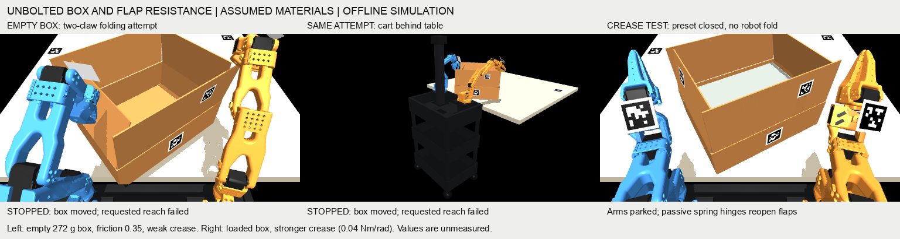

# Unbolted carton and resistant flaps

The updated simulation exposes two limits of the earlier successful GIF:
the empty box moves during the two-claw contact sequence, and sufficiently
resistant creases reopen after support is removed. No new general folding
success is claimed. The loaded, weak-crease reference still passes.



## What changed

The box already had a six-degree-of-freedom free joint. It was never bolted to
the world. However, the passing example included 960 g of contents, a table
friction coefficient of 0.7 and weak 0.008 Nm/rad springs. Its final score only
covered the period while both hands pressed down.

The simulator now exposes empty cardboard mass, contents mass and support
height, table friction, crease stiffness (including four unequal values),
crease friction, damping and rest angle. Zero contents mass removes both the
extra weight and the internal support surface. Defaults are now an empty
272 g box, friction 0.35 and stiffness 0.018 Nm/rad. These are **unmeasured
sensitivity assumptions**, not identified properties of the user's carton.

The table/cardboard friction is an explicit contact-pair setting. Merely
lowering the table geom's coefficient would leave the larger cardboard value
in effect under [MuJoCo's friction-mixing rule](https://mujoco.readthedocs.io/en/stable/modeling.html#contact-parameters).
The old normal-contact response is preserved to avoid changing two physical
effects at once. No weld, clamp, guide, tape or invisible flap latch is added.

`held_closure_passed` records the two-second paired hold. Overall `success`
also requires withdrawal without reopening, five seconds without hand/flap
contact, all four angles within 5 degrees of horizontal, the box remaining
fully over the tabletop, no forbidden collision and a fresh final visual
observation. Disabling release leaves retention unverified. Independent logs
record maximum box displacement, rotation and table-edge clearance.

## Results

| Case | Result |
| --- | --- |
| Loaded 960 g; friction 0.7; stiffness 0.008 | Held closure and five-second hands-off retention pass |
| Empty; friction 0.35; stiffness 0.008 | Fails: box moves about 35 mm horizontally in recorded frames; requested reach becomes invalid |
| Empty; stiffness 0.018 | Fails: box moves/tips; collision stop |
| Empty; friction 0.15 | Fails: box tips and leaves the tracked view |
| Loaded 960 g; friction 0.35; stiffness 0.018 or 0.04 | Fails: box movement invalidates the contact approach |
| Unequal creases, heavier empty carton, or 150 g contents | All three tested variants fail |

These nine deliberately selected cases are not a statistical success rate.
Large three-dimensional displacement in tipping cases includes vertical
motion; it must not be reported as pure sliding distance. The starting box
corner is only 10 mm inside the table, as in the previous successful layout.
The loss of support is a station-design problem as well as a controller problem.

Separate passive material tests start with **preset closed flaps** and parked
arms. They are not robot-folding demonstrations. With 960 g contents and no
hand contact, the 0.008 Nm/rad case stays closed; at 0.018 the long flaps reopen
about 42 degrees from horizontal in five seconds; at 0.04 all flaps return to
within roughly 0–6 degrees of upright. Thus internal contents cannot be assumed
to stop springback. The comparison GIF labels this preset condition explicitly.

94 focused unit/physics tests pass, including a 2 N push that moves a low-friction
free box while the same high-friction box stays nearly still, actual compiled
crease torques, content removal/mass checks and passive springback.
[Parameters, outcomes and local artifacts](evidence/carton-free-box-springback.json).

## Paddle or claws?

The promising next strategy is **one claw bracing the rim/wall and a paddle
folding or retaining the panels**, then maintaining pressure during taping.
This is an engineering hypothesis, not a measured paddle victory. A paddle
provides a broad pressing surface and additional reach; claws can pinch an
edge and supply the opposing reaction needed to keep a loose box in place.
The paddle does not remove crease resistance or automatically anchor the box,
and its extra lever arm increases wrist-load and clearance concerns.

The existing [210 x 40 x 6 mm paddle](../parts/carton/README.md) should be reused
for that comparison, with an actual grip/mount model. Current trials use stock
SO101 claws, not the white compliant attachments in the photos. Neither a
validated paddle grasp nor a brace-and-paddle controller is claimed here.
Finished flaps need continuing support until tape or another physical closure
retains them; both hands cannot simply leave a springy untaped box.

Carton research explicitly models residual crease moment and panel compliance
([Cannella and Dai, 2006](https://journals.sagepub.com/doi/10.1243/09544062JMES242)).
Our model only has rigid panels with elastic, frictional, damped hinges. It
does not identify real cardboard stiffness, plastic crease conditioning,
hysteresis, moisture effects or panel buckling. Measure crease force versus
angle, box weight and table slip onset before treating a trial as predictive.

## Reproduce and perception dependency

```sh
cd /path/to/xlerobot-farm/software
PYTHONPATH=. python tools/evaluate_free_carton.py \
  --simulation-root /absolute/path/to/gemma-xlerobot \
  --out /absolute/path/to/new-free-carton-matrix --video

# Diagnostic only: explicitly preset closed flaps, then observe springback.
PYTHONPATH=. python tools/probe_carton_springback.py \
  --simulation-root /absolute/path/to/gemma-xlerobot \
  --out /absolute/path/to/new-passive-test --stiffness .04
```

The folding controller still requires **RGB plus aligned depth**: tag corners
identify objects, and depth supplies metric registration and visible flap
angles. Missing depth stops it. The simulator generates the depth stream; it
does not access the live OAK-D Lite. RGB-only tag pose estimation is possible
in the shared tag stack with measured sizes and calibrated intrinsics, but it
is not a fallback implemented in this folding controller. The passive material
probe bypasses perception entirely because it tests physics, not autonomy.

No physical robot commands, real camera calls or hardware calibration changes
were made for these tests.
