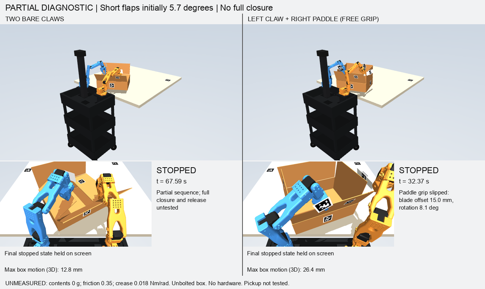

# Resistant free-carton hand transfers — 6 October 2026

Later result: [paddle end contact](carton-paddle-end-contact-audit.md) now also
folds both short flaps with a different initial grip. Neither variant completes
the carton. The paddle failure below refers to the original face-contact grip.

Neither tool variant completes the carton task. The bare claws now fold and
hold **both short flaps**. Withdrawing the left hand makes its flap reopen.
The paddle still fails before completing the first short flap. These are
partial physics experiments, not successful folding cycles or hardware tests.



## Reproduced comparison

The same empty 272 g free carton, 0.35 table friction, 0.018 Nm/rad hinge
stiffness, 0.004 Nm crease friction and 0.008 Nms/rad damping apply to both
variants. Spring rests remain upright. The box has no weld, clamp, guide or
contents; only the 12 original robot actuators drive motion. Joint travel,
force, slip, tracking and collision gates remain unchanged. Material values,
station geometry and the external camera remain unmeasured assumptions.

| Result | Two bare claws | Left claw + right paddle |
|---|---:|---:|
| Short flaps while held | 92.44° left / 91.92° right | First short not completed |
| Released left short after withdrawal + 2 s | 58.40° | Not reached |
| Maximum box translation | 12.81 mm | 26.45 mm |
| Minimum bottom-corner distance inside table edge | 5.92 mm | −0.58 mm |
| Simulated duration | 67.592 s | 32.366 s |
| All four folds and hands-off retention | **No** | **No** |

The camera separately measured 92.71°/91.91° at the two-short hold, and 58.59°
for the released left flap. The angles above use independent simulator
evaluation. A horizontal flap is approximately 90°; 0° is upright.

The left hand first pinches the near flap outward to brace the box while the
right folds its short flap. It then releases that pinch, withdraws, plans an
approach with 6 mm obstacle clearance, and folds the other short flap. The
right arm holds its joint targets throughout that transfer. Clearance only
inflates the copied planning model; it does not alter contact physics.

The resulting two-flap hold is a useful stage, but **is not retention**.
The recorded release test explicitly demonstrates spring-back. No tape or
adhesive was silently added. Full closure, a usable hand transfer to the long
flaps, tape application and five seconds with both hands clear remain undone.

## What the failed transfers reveal

- Attempting to bridge both short flaps with the stock right gripper did not
  establish contact with both panels. In one run the left flap reopened to
  62.51° after left-hand withdrawal. The commanded bridge orientation was not
  achieved, and it also drove the near panel outward. Command completion must
  not be used as a retention success flag.
- Three attempts to fold the near major panel after releasing the left minor
  displaced the free carton by roughly 139–160 mm and lost fresh registration.
  The contact trace shows the **right forearm obstructing the near flap's
  sweep** while its hand holds the right minor. A new contact pose is needed;
  continuing that same arc cannot be justified by successful fingertip IK.
- A planning-only scan of 48 position-feasible right-hand hold candidates
  found forearm collisions with the near panel's prospective sweep. This is
  evidence against those sampled poses, not proof that every possible strategy
  is infeasible.
- A 6 mm-clearance approach to the far flap was rejected because its gripper
  came within 3.09 mm of that panel. This is a close approach, not an actual
  3.09 mm penetration; the planner reports signed separation. A subsequent
  2 mm-clearance diagnostic exposed a different jaw part intersecting that
  panel by 2.77 mm, so that same approach remains invalid.
- The original paddle trace is more specific than “slipped under folding
  load”: the gripper contacts the wrong near flap while the blade has not yet
  contacted cardboard. It then reaches the 15 mm slip stop. Alternate grips,
  face orientations and edge approaches still failed reach, collision or
  slip checks. There is no demonstrated paddle improvement yet.

## Tool observations and validation

The offline camera can now recover a paddle pose from declared tag 3 or 23
using the existing aligned-depth estimator. Missing tags return no estimate;
non-rigid transforms or disagreeing faces are rejected. These tag mounts are
proposed simulation geometry, not physically calibrated mounts. Their 40 mm
black squares have a 50 mm white backing, which overhangs a 40 mm blade.

A separate observed tool target allows future pose correction without moving
the original grip-slip reference. Tool calibration therefore cannot erase
accumulated slip. Tool-local tangent axes are supported in both IK and motion
telemetry. Optional grasp positions change initialization only; they never
reset a moving tool or create a weld.

80 focused tests pass, including free-body sliding, spring-back, zero added
tool support, independent slip reference, invalid tool observations and
planning clearance that leaves the physical model untouched.

## Reproduction and evidence

With the existing SO101 assets and the offline simulation environment:

```sh
PYTHONPATH=. .venv/bin/python tools/diagnose_braced_folding.py \
  --simulation-root /absolute/path/to/gemma-xlerobot \
  --out /absolute/path/to/review/minors-claws \
  --tool claws --fold-second-short --release-left-minor --video

PYTHONPATH=. .venv/bin/python tools/diagnose_braced_folding.py \
  --simulation-root /absolute/path/to/gemma-xlerobot \
  --out /absolute/path/to/review/minors-paddle \
  --tool paddle --fold-second-short --release-left-minor --video

PYTHONPATH=. .venv/bin/python tools/render_folding_comparison.py \
  --comparison /absolute/path/to/review --case minors
```

Each output directory must be new. Both runners always report full-task
success false. Full GIFs cover every recorded stage and preserve failure
states, with whole-robot and close views. Source hashes, result hashes, complete
GIF metadata and exploratory failures are in
[the evidence file](evidence/carton-minor-transfer-progress.json).

Local full GIFs are in
`/Users/wk/Documents/ChatGPT/Hackatuson/output/bimanual-fold-sim/regrasp-folding/review/`:
`minors-claws-full.gif`, `minors-paddle-full.gif`, and
`minors-full-comparison.gif`. The last recorded physical state is held on
screen for 2.5 seconds; this display pause does not count as simulated retention.
