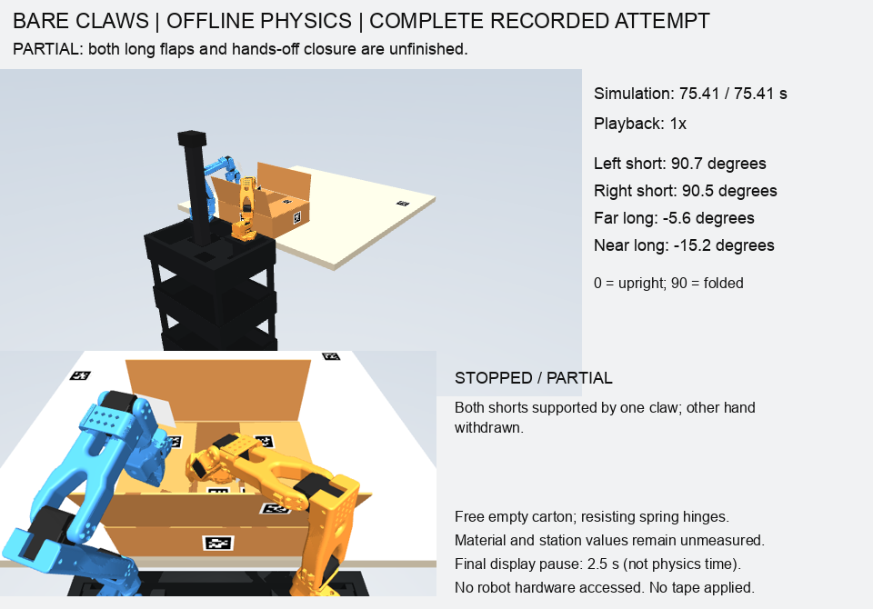

# Bare-claw retention and parallel controller experiments — 7 October 2026

**Full carton closure is still incomplete.** The bare claws can now fold both
short flaps and transfer their support to one open right claw. The left hand
then withdraws and both short flaps remain within 85–95 degrees for the entire
five-second observation. The best tested configurations each passed 8 of 9
distinct camera-noise seeds. This is a partial stage, not a reliable full
folding cycle, a trained neural policy, or a hardware result.



> Later experiments fix the major-flap observer and physically open the shorts
> outward before achieving a partial near-major hold. See the
> [near-major follow-up](carton-near-transfer.md). This page preserves the
> earlier short-first experiment and its failures.

## Physical changes to the sequence

The left claw initially pinches the left short flap to brace the free carton.
The right claw physically pushes the near long flap slightly outward, using
fresh vision to stop, then returns to its park pose. The right short flap is
folded while the left hand braces. The left hand subsequently releases its
pinch, clears the panel, and presses the left short flap down.

The stock right claw turns and opens across the gap between the two short
flaps. Its actual fixed and moving CAD finger vertices are placed near
box-local x = −52/+52 mm, y = −40 mm. The selected height is 111 mm above the
box frame origin. This leaves only about 2.5 mm overlap on each flap edge,
so the candidate is sensitive to registration error. It is not a proposed
hardware-ready trajectory.

The left hand unloads gradually in 2 mm upward steps. Loaded contacts on both
outer broad faces must be established by the right fingers before the left
hand fully withdraws. The full withdrawal and five-second observation must
retain both short angles within 85–95 degrees, with no left-hand contact.
Right-finger loaded contact is checked again after withdrawal. No successful
angle, contact, or support state is prescribed by the simulator.

## Failure discovered and corrected

The original second-short approach permitted finger contact during a joint
transit. One noise seed selected a nominally collision-valid shortcut that
pushed the carton about 79 mm during that transit; the old sequence continued
and reached 109 mm maximum horizontal movement. Allowing small penetration did
not make that a valid free approach.

The revised sequence first moves the fingers outward/upward, then requires
6 mm clearance for the transit. Fresh visual checks reject excessive carton
translation, rotation, stalled folding, or loss of the other short-flap hold.
The large slide did not recur in the tested revised hold sequences.

Independent contact-force scoring now runs `mj_forward` in a copied `MjData`:
`mj_step` leaves its contact arrays at the state before its last integration.
The copy aligns force evidence with current positions without advancing time,
altering controls, or changing the executing world's solver warm start. Tests
verify that stale contacts cannot establish current support. No force or
clearance gate was reduced to accept a failed run.

## Measured experiment results

All following trials use the same free 272 g empty carton, resisting hinges,
actual SO101 CAD, fixed robot/table spacing, original actuator/joint limits,
2 ms timestep and friction solver. The camera has 0.8 mm synthetic depth noise
and 25% dropped pixels. These material, noise and station values are unmeasured
assumptions; physical transfer has not been verified.

| Controller candidate | Result |
|---|---|
| Original one-claw transfer | One seed passed; another slid the carton before transfer. |
| Clear transit plus fixed receiving height, before gradual unloading | Avoided the slide, but receiving-contact checks failed. |
| Gradual unloading, near flap target −15°, receiving heights 111/113 mm, seeds 0–2 | 6/6 partial holds passed; six runs completed in 85.48 wall seconds with three workers. |
| Same −15°/111 mm candidate, distinct seeds 0–8 | 8/9 partial holds passed. Seed 7 stopped with 5.53 mm forearm clearance, below the required 6 mm. |
| Wider physical near opening, −17°/111 mm, distinct seeds 0–8 | 8/9 partial holds passed. Seed 0 retained the angles but failed the final right-contact force check; it remains a failure. |
| Initial carton moved ±50, ±100, ±150 mm sideways | All six stopped at the initial pregrasp IK gate. The existing approach does not transfer to those placements. This does not prove that a different approach cannot work. |
| Near-major approach at x = −100 mm on the panel | Three trials retained the shorts, then missed the approach IK target by 23.95 mm, beyond the 8 mm gate. Withdrawal timings were not reached. |
| Near-major approach at panel center | Three trials retained the shorts, then lost a valid visible near-flap angle during approach. They stopped before evaluating their different withdrawal timings. |

The illustrated −15°/111 mm seed-0 run lasts 75.414 simulated seconds. Its
final short angles are 90.69° and 90.45°, with maximum horizontal box movement
0.033 mm. The long flaps remain open at −5.62° and −15.25°. The 1.10 mm maximum
3D displacement is predominantly initial vertical settling. A tabletop box
can slide in this model; the result does not come from a fixed-base constraint.

The −17° candidate has the same pass count but a different failing seed. Do
not select the successful seed from each candidate and call that a 9/9 policy.
The complete runs and their failures are preserved separately.

The center-approach trace also exposes a perception failure: an unlabelled
depth-plane estimate briefly reported +13.23° while the physical flap was
still around −15°. The next view lacked an angle and stopped the sequence.
That depth-plane estimate is not a verified fold. Better visibility or an
identity-supported observation is required before using this major-flap
approach. The current stop prevents proceeding through the missing observation;
it does not make the preceding bad estimate accurate.

## Parallel execution and reproduction

`tools/run_claw_sweep.py` starts up to four separate local worker processes
(default three), with one source snapshot, independent output/log directories,
distinct declared seeds and parameters, and bounded worker timeouts. BLAS thread
counts are capped to avoid oversubscribing the CPU. Workers never share a
training checkpoint or write to the source snapshot. Every trial starts from
the declared open carton and executes the complete physical sequence.

This is parallel controller testing/search, not gradient training of MolmoAct2
or ACT weights. The six-run batch's summed worker time divided by batch wall
time was 2.98, demonstrating concurrent execution; it is not a controlled
serial-versus-parallel speed benchmark.

```sh
# From software/, using a new output directory.
PYTHONPATH=. .venv/bin/python tools/run_claw_sweep.py \
  --simulation-root /absolute/path/to/gemma-xlerobot \
  --out /absolute/new/parallel-claw-results \
  --workers 3 --seeds 0 1 2 3 4 5 6 7 8 \
  --near-targets -15 --support-heights .111 --video

PYTHONPATH=. .venv/bin/python tools/render_claw_retention.py \
  --run /absolute/new/parallel-claw-results/trial-000/run \
  --out /absolute/new/claw-review
```

The renderer replays recorded qpos and timestamps, shows the whole robot and
a close view, and labels the outcome partial. Its 2.5-second final display
pause does not count as physics time. The raw simulator GIF uses constant
capture durations and should not be presented as a real-time replay.

The reviewed complete partial-attempt GIF is local:
`/Users/wk/Documents/ChatGPT/Hackatuson/output/bimanual-fold-sim/claws-retention/progressive-handoff-review-01/bare-claws-complete-attempt.gif`.
It was decoded across all 379 frames: 75.414 s physics, 77.91 s playback including
the display pause. The source has 505 recorded states with maximum gap 0.4 s.

## Remaining work and validation

The receiving support still has a narrow tolerance. Long-flap reach and the
forearm's interference with the near flap remain unresolved. Near-major
withdrawal-angle experiments are separately reported in the evidence file;
stopping in their prefix is not a major-fold experiment result. No four-flap
closure, robot-applied tape, or final five seconds with both hands clear has
passed. The passive tape component also remains numerically unvalidated for
this folding timestep; see `carton-tape-material-audit.md`.

120 focused tests pass, including real concurrent subprocess isolation,
source-snapshot stability, crashed-worker rejection, stale-contact rejection,
support-face scoring, free-box sliding and flap spring-back. Those tests do
not replace the simulation outcomes above. Source/result hashes, complete
trial summaries and GIF metadata are in
[the evidence file](evidence/carton-open-claw-retention.json).
