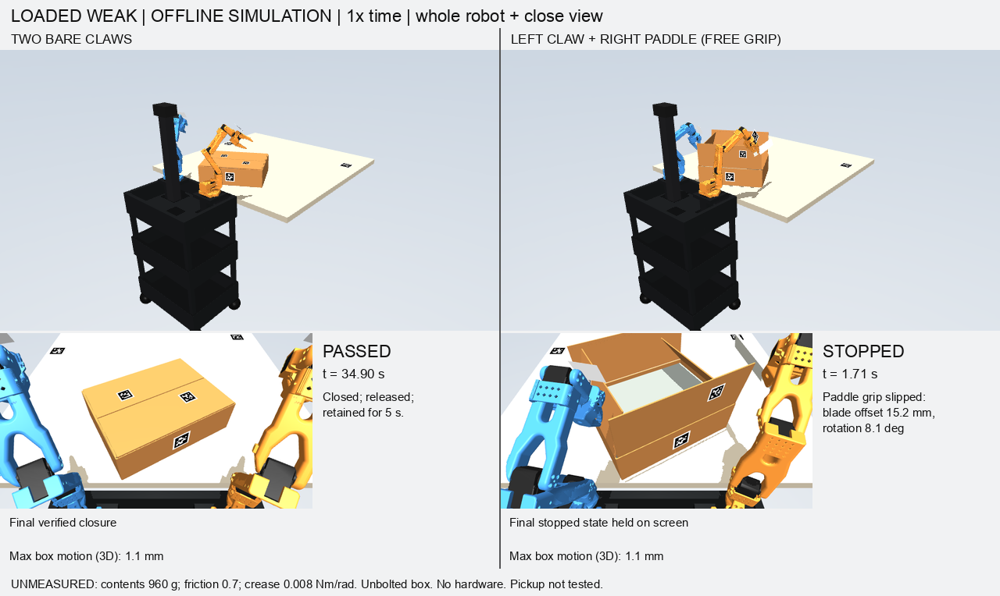

# Paddle versus bare claws: matched offline comparison

**Historical results below are superseded.** An initialization audit found
approximately 11 mm of adjacent-panel intersection when all four flaps started
0.1 radians inward. Those runs, including the loaded weak-crease "pass", are
not valid folding evidence. The initializer now rejects that state. See the
[corrected bracing and physics audit](carton-braced-folding-audit.md) for current
results. The commands below now use the corrected initializer and will not
reproduce the historical numbers without the historical source revision.

The table records the original outputs for debugging; it is not valid evidence
comparing the physical tools. Neither method demonstrated empty-carton closure.
No physical robot or camera was accessed.



## Matched conditions and outcome

Both variants use the same SO101 arms, original joint and torque limits,
rear-cart geometry, free carton, material values, camera, AprilTag pipeline,
depth noise/dropout and random seed. Arm bases are 150 mm behind the table
edge and 60 mm above it. The carton is yawed 30 degrees, with its nearest
bottom corner only 10 mm inside the tabletop. These are hypothetical station
dimensions, not measurements of the user's setup.

The alternatives are two stock claws, or a left claw plus the actual
210 x 40 x 6 mm paddle in the right jaws. The latter uses blade-centre IK,
the correct blade/contact thickness offset and a face-normal orientation
objective. It follows the same flap order and intended panel contact locations.
It keeps the tool-holding jaw closed when withdrawing from the carton.

| Material case | Bare claws | Left claw + right paddle |
|---|---|---|
| Empty 272 g carton; friction 0.35; crease 0.018 Nm/rad | Stops at 1.578 s: box tips, then forbidden contact | Stops at 1.620 s: box tips and table registration is lost |
| Empty; friction 0.35; weaker 0.008 crease | Stops at 1.620 s: box moves, next left target misses by 9.6 mm | Stops at 1.620 s: box moves, next left target misses by 9.5 mm |
| 960 g contents; friction 0.35; 0.018 crease | Stops at 1.620 s: next left target misses by 8.6 mm | Stops at 1.400 s: tool target tracking error exceeds 35 mm |
| 960 g contents; friction 0.7; weak 0.008 crease | **Pass:** all four folded, two-second hold, withdrawal and five seconds without hand contact; total 34.900 s | Stops at 1.710 s: blade slips 15.2 mm relative to calibrated grip, rotating 8.1 degrees |

The passing claw case ends at 91.84, 91.84, 90.26 and 90.26 degrees from
upright, with maximum box translation 1.11 mm. This is the favorable loaded,
weak-crease reference, not evidence of empty-box reliability. The four selected
cases are not a statistical success-rate estimate.

The paddle does have a local advantage in one failed trial: the right short
flap reaches 48.5 degrees in the empty weak-crease case, versus 7.5 with the
right claw. However, the box moves approximately 36 mm in both and the next
left-hand target becomes unreachable. More progress on one flap is not a
closed carton. In the resistant empty cases the box tips substantially;
the reported 227/271 mm maximum translations are **3D motion including the
fall**, not horizontal sliding distances.

## Tool model, reuse and limitations

The paddle visual mesh is `parts/carton/paddle_flap.stl`. Collision regions
reuse its rectangular blade, handle and two grip grooves, as in the existing
paddle grasp simulation. Its assumed mass is 30 g and sliding friction 0.8.
Explicit tool/jaw contact pairs prevent friction mixing from invalidating the
zero-friction control. The original 0.5 Nm jaw and 2.94 Nm arm actuator limits
remain unchanged.

Before this comparison the existing single-arm paddle grasp experiment was
replayed successfully through close, lift and hold. Both jaws contacted the
handle and the paddle cleared the table by 64.37 mm. That experiment's settled
**simulated** grip transform was reused as an initial condition here. The
paddle has a six-DOF free joint: no weld, hidden actuator or ongoing pose reset.
Pickup in this two-arm station is not tested. A 15 mm blade-offset or
20-degree grip-rotation limit stops the attempt.
That slip check is an independent simulator diagnostic using the true tool
pose versus its encoder-predicted pose. It is not a live paddle tracker;
physical use would need observed tool pose and a calibrated mount. No hardware
motion adapter or live tool-tracking integration is introduced here.

The initial right wrist roll is 1.5 radians in both matched variants, within
the original travel limits. This keeps the original two table anchors and
both housing tags visible with the paddle present. Earlier diagnostic runs
with the old wrist pose or moved anchors are preserved locally, but are not
the final matched comparison.

The controller prioritizes blade face orientation and leaves in-plane yaw
free. An earlier full-orientation target overconstrained the five-axis arm;
that diagnostic is excluded from the final results. Even the corrected
planner has approximately 23–26 degrees of face-normal error in early
approaches. Reach, orientation, contact paths and grip therefore still need
tool-specific optimization. These results compare the implemented sequences;
they do not prove an optimized paddle controller or a different paddle mount
could never outperform claws.

Separate diagnostics also fail: an **explicit ideal rigid attachment** avoids
slip but does not complete folding (loaded weak case stops at 2.940 s with a
36+ mm target tracking error); a 15 g paddle and higher friction do not rescue
the empty resistant case. Zero friction produces the expected early grip
failure at 0.060 s. Rigid attachment is labeled as a diagnostic and is never
presented as a validated physical grasp.

All cardboard parameters remain unmeasured. Panels are rigid with passive
elastic/frictional hinges; panel bending, crease training, printed-tool
compliance and the unidentified white fingertip attachments are not modeled.
The next substantial improvement is box bracing plus flap retention, and a
tool-specific reachable contact plan if the paddle is retained. Swapping
end effectors alone has not solved those problems.

## Reproduce and inspect

Use the pinned offline dependencies and the existing real-arm scene asset
directory described in the prior simulation guides:

```sh
PYTHONPATH=. .venv/bin/python tools/compare_folding_tools.py \
  --simulation-root /absolute/path/to/gemma-xlerobot \
  --out /absolute/path/to/new-comparison

PYTHONPATH=. .venv/bin/python tools/render_folding_comparison.py \
  --comparison /absolute/path/to/new-comparison --case empty-resistant
PYTHONPATH=. .venv/bin/python tools/render_folding_comparison.py \
  --comparison /absolute/path/to/new-comparison --case loaded-weak
```

The runner preserves old outputs, runs four matched pairs and five separate
diagnostics, and writes the source hashes, scene XML, joint recordings and
independent physics outcomes. The GIF renderer shows the entire recorded
timeline at real time, with whole-robot and close views. A stopped variant
keeps its final state onscreen with its stop time and reason while the other
continues. There is no invented continuation or interpolated success.

[Machine-readable evidence](evidence/carton-paddle-comparison.json).
The complete rendered GIFs remain in the local comparison output directory.
102 focused tests pass, including free-body gravity, contact exclusions,
attachment labeling, tool orientation, carton physics and perception tests.
