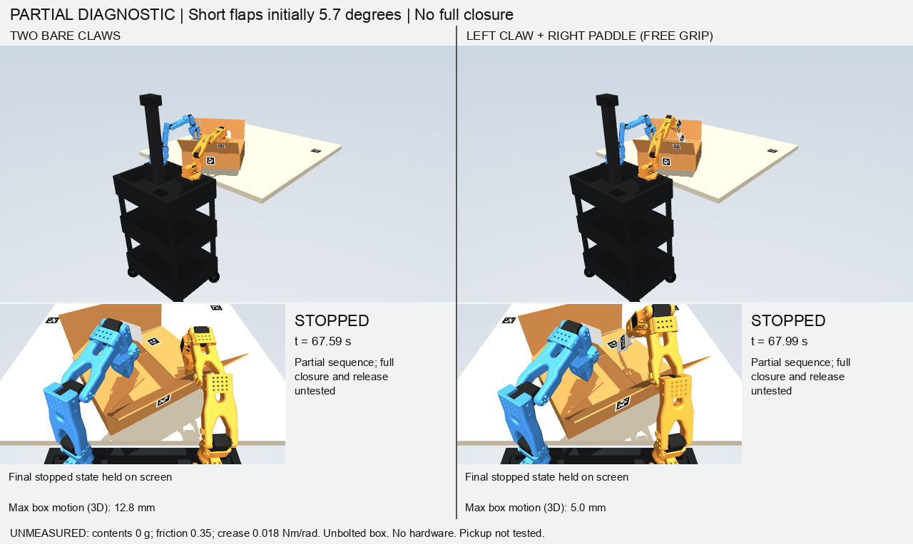

# Paddle end contact with a resistant, free carton — 6 October 2026

Both variants now fold and hold the two short flaps. Neither completes the
carton. Withdrawing the left hand lets its short flap spring back to about
58° from upright. The new paddle grip improves this partial stage; it does
not yet establish which tool is better for a complete folding and taping cycle.



## Matched physical conditions

The carton is an empty 272 g free body with all six motion degrees of freedom.
It has no weld, clamp, guide, contents or adhesive. Table friction is 0.35.
Each crease has stiffness 0.018 Nm/rad, friction 0.004 Nm and damping
0.008 Nms/rad, with its spring rest upright. At a 90° fold the spring alone
exerts an opening moment of 0.0283 Nm. Panels are rigid: bending and permanent
crease deformation remain unmodeled. These are explicit, unmeasured material
assumptions, not measurements of the user's carton.

The robot remains behind the table with the same station geometry, carton
placement and original joint/force limits. There are only 12 robot actuators.
The camera remains a proposed external RGB-D camera, using rendered AprilTags
and aligned depth with noise and missing pixels. It is not a validated
physical OAK-D setup. No hardware commands were issued.

| Result | Two bare claws | Left claw + right paddle, end contact |
|---|---:|---:|
| Short flaps while held, left / right | 92.44° / 91.92° | 92.04° / 93.34° |
| Left short after withdrawal + 2 s | 58.40° | 58.30° |
| Maximum box translation, 3D | 12.81 mm | 4.96 mm |
| Maximum box rotation | 1.51° | 0.16° |
| Smallest bottom-corner distance inside table edge | 5.92 mm | 5.89 mm |
| Maximum end-of-command TCP error | 10.30 mm | 7.63 mm |
| Simulated duration | 67.592 s | 67.994 s |
| All four folds, withdrawal, 5 s retention | **Not completed** | **Not completed** |

The independent camera estimates the released flap at 58.59° for claws and
58.62° for the paddle run. Horizontal is approximately 90°. The GIFs show the
entire recorded attempts, including release and spring-back. Their final
2.5-second display pause does not count as physical retention.

## What changed

The paddle is initially placed in the jaws at 60 mm from its handle base and
rotated −71° in the jaw plane, allowing its end to push the short flap while
the wrist stays above the rim. It remains a passive free body held by friction,
with the same 30 g mass, 0.8 grip friction and 0.5 Nm jaw torque limit. Pickup
and physically establishing this grip are not tested. Maximum original blade
reference drift was 1.80 mm and maximum grip rotation was 4.05°.

Fresh rendered tag/depth observations register a CAD point 208 mm from the
handle base as the commanded tool point. Calibration changes only measurement
sites; it cannot reposition the paddle, change its dynamics or move the
original slip reference. Actual motion verification now measures the point
on the free paddle, rather than only a virtual point attached to the gripper.
The existing 35 mm tracking gate therefore cannot pass a target merely because
the arm reached it while the tool was elsewhere.

The earlier face-contact variant and its slip failure remain documented in
[the preceding transfer audit](carton-minor-transfer-audit.md). Its result is
not silently relabeled as the new end-contact result.

## Remaining transfer problem

Both minor flaps need continuous restraint until a major flap can take over
that restraint. Merely lifting one hand and moving it to a long flap releases
the short flap. Earlier long-flap approaches then stalled or displaced the
free box. The new end-contact grip does not resolve that transition by itself.

A separate static experiment found poses with one fixed fingertip on the left
minor and the moving fingertip outside the near major. Keeping both contact
locations fixed became unreachable beyond roughly −26° of near-flap angle.
Allowing the contacts to slide produced position-feasible poses, but also
identified gripper-housing interference during part of the major-flap sweep.
A follow-up contact audit found 2.1–8.9 mm of jaw/panel interpenetration in
those static poses. Permitting intended jaw contacts in a static search had
not limited their depth. The poses are therefore **invalid as contact plans**;
fingertip reachability does not establish usable whole-hand geometry.

The first dynamic approach was rejected before contact because another part
of the moving jaw came within 0.75 mm of the near flap, below its 6 mm planning
clearance. A farther approach still had only 3.84 mm clearance. Moving farther
out again exceeded the 8 mm position-error gate with a 10.6 mm miss. All three
stopped before executing their proposed approach. No actual major-flap
transfer is validated, and none of these exploratory poses is enabled in the
reproduced short-flap runner.

Full long-flap folding, explicit tape application and final hands-off retention
remain unfinished. Material measurements and physical mounting/calibration
also remain unverified. No constraint was added to make a flap stay closed.

## Reproduce and inspect

```sh
PYTHONPATH=. .venv/bin/python tools/diagnose_braced_folding.py \
  --simulation-root /absolute/path/to/gemma-xlerobot \
  --out /absolute/path/to/review/tip-claws --tool claws \
  --fold-second-short --release-left-minor --video

PYTHONPATH=. .venv/bin/python tools/diagnose_braced_folding.py \
  --simulation-root /absolute/path/to/gemma-xlerobot \
  --out /absolute/path/to/review/tip-paddle --tool paddle \
  --paddle-contact tip --fold-second-short --release-left-minor --video

PYTHONPATH=. .venv/bin/python tools/render_folding_comparison.py \
  --comparison /absolute/path/to/review --case tip
```

All 88 folding tests pass. These include sliding and spring-back negative
controls, passive tool support, fresh rigid-pose validation, unchanged slip
references and rejection of a virtual target when the real tool is elsewhere.

Full local GIFs are under
`/Users/wk/Documents/ChatGPT/Hackatuson/output/bimanual-fold-sim/station-transfer/review/`:
`tip-claws-full.gif`, `tip-paddle-full.gif`, and `tip-full-comparison.gif`.
Source hashes, decoded GIF metadata and quantitative results are recorded in
[the evidence file](evidence/carton-paddle-end-contact-progress.json).
