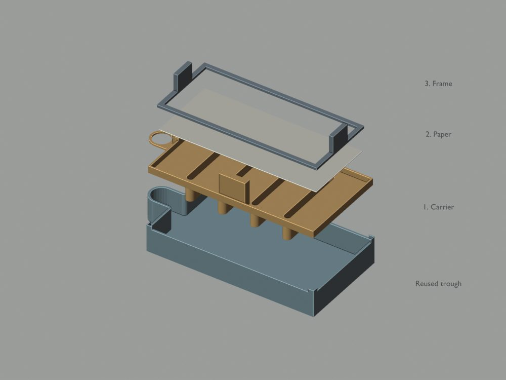
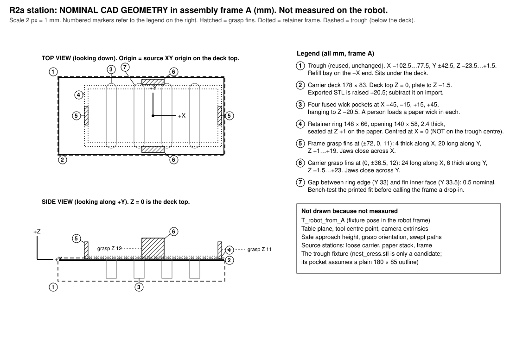
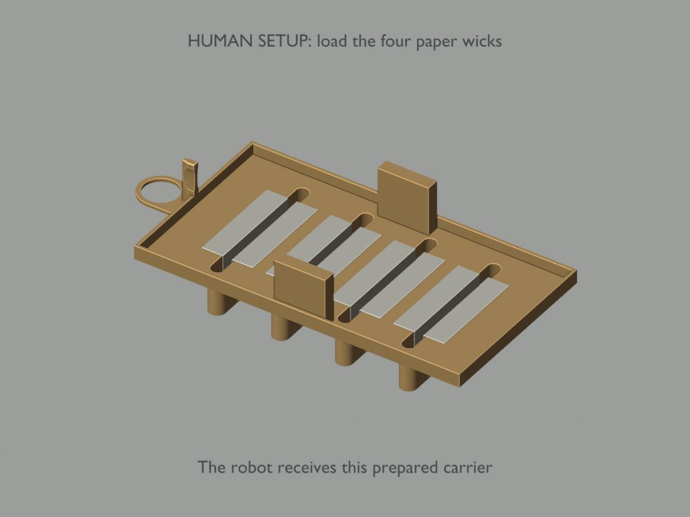
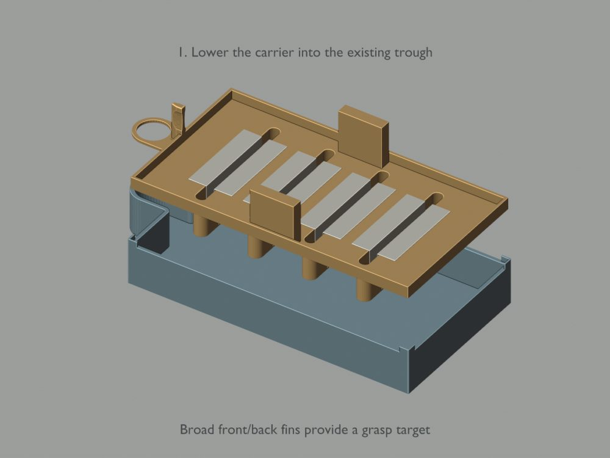
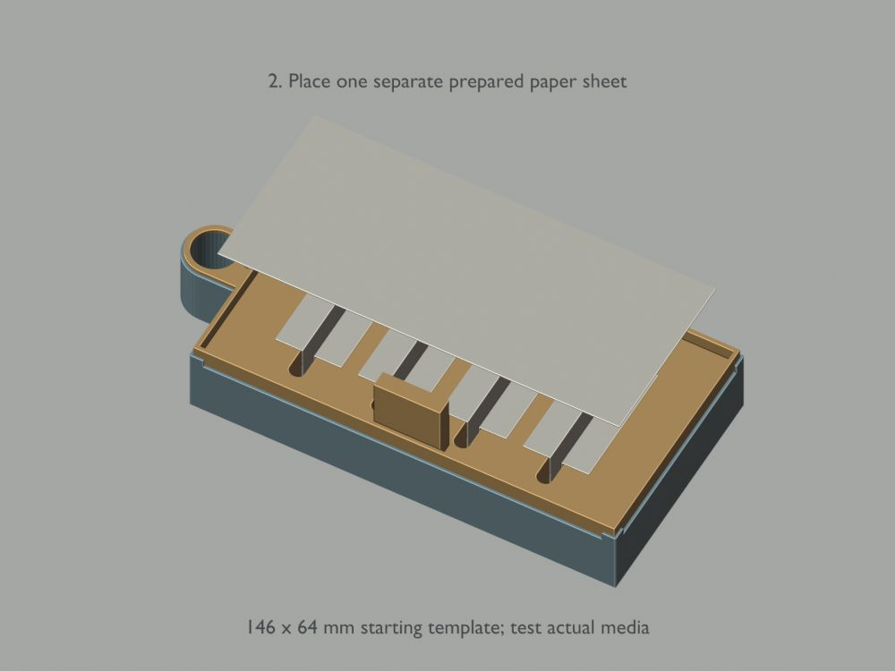
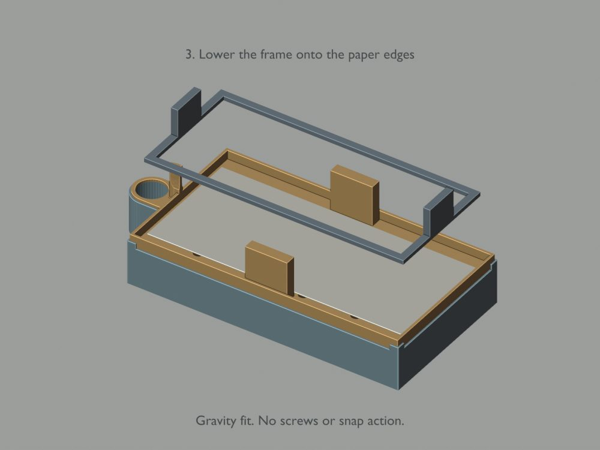

# R2a cress-planter assembly: contract, reconciliation and station plan

Written 2026-10-03 from the design handoff (`docs/r2a-handoff.md`, copied from the design chat).
Status: **the R2a full prototype plate was observed printing at 15:19 JST on October 3; completion and
inspection remain unconfirmed.** The contract, offline supervisor rehearsal and station-fitting tool exist.
The user reports calibration in progress on the other Mac connected to the robot. This session has not
measured, gripped or moved anything. Execution remains disabled in `profiles/r2a-assembly-v0.yaml`.
See [the connected-Mac continuation](r2a-connected-mac.md) for the next steps after calibration finishes.

The goal of this milestone is small on purpose: a person loads four paper wicks and fixes the empty trough;
the robot places the prepared carrier, one real top sheet, and optionally the retaining frame. It is not
construction from loose consumables, sowing, watering or harvesting.

## 1. Reconciliation with the robot status (what is still missing)

Checked against `STATUS.md` at commit `bb30bb3` and the handoff. Nothing below was re-probed on hardware in this session.

| Needed before any R2a trial | State on 2026-10-03 | Where it gets resolved |
|---|---|---|
| Printed carrier, frame, coupon, inspected (cracks, warped seats, blocked pockets, fin roots) | Print was running on the M5C at ~15:19 JST after one off-edge failure; completion and parts **not seen**. The M5C has no camera. | Person inspects; photo + instance id go into the first episode's metadata |
| Carrier dry-fitted to the real trough by hand | Not done | Person; record any sanding as `manual_modifications` |
| Trough fixture (measured, non-sliding) | Not designed. `parts/out/nest_cress.stl` is a *candidate* whose pocket assumes a plain 180 × 85 outline; the real trough has the refill bay on −X | Fit test on the printed trough before trusting it |
| Source stations for carrier, paper stack, frame | Not designed. Paper presentation is the hardest open item | Design + bench test; if real paper cannot be picked, record the blocker |
| Robot bring-up: ports, cameras by identity, calibration, `robot-test` | Profile still has empty `port1`/`port2`, no camera indices, no calibration; one arm probed, cameras never opened | `/farm-bringup` skill, Steps 1 to 5 |
| T_robot_from_A (fixture pose in robot frame) | Not measured. `data/r2a/station.yaml` does not exist; code refuses robot coordinates until it does | Person measures; `RobotFromAssembly.save` writes it with method/date/by |
| Grip thresholds for 6 mm fin, 4 mm fin, paper | Not measured. All six values are `null` in the profile; the bottle's 8/15 thresholds are not reused | Coupon first, then real parts, over a catch area |
| Camera identities for `right_wrist` and `head` | Unknown until `farm devices --probe` and `farm check` | Bring-up Step 3/5 |
| Cameras in the kit at all | Open question from the previous session (vendor page silent) | Person checks the box |

The table above records the original handoff snapshot. Calibration is now in progress on the other Mac,
as reported by the user; its result and the camera bindings have not been read back here. The new commands
below prepare that continuation without opening devices or changing calibration.

### Continuation tools added after the handoff

- `farm r2a --simulate`: exercises the discrete pick/transfer/support/release/retreat checks in both variants.
  `--fault double_paper` and the other faults listed in `--help` stop the episode without release/park/retry
  after uncertainty. This is a synthetic supervisor rehearsal, not a physics simulation or a robot success.
  Trace JSON is explicitly ineligible for training and cannot overwrite an earlier trace.
- `farm r2a`: now also reads the robot profile, saved calibration, and isolated R2a keyframe file. It never
  opens ports/cameras, and passing static checks no longer prints an unconditional execution approval.
- `farm r2a-station --measurements data/r2a/measurements.yaml --output data/r2a/station.yaml`: fits actual
  paired measurements, checks an independent point, rejects poor geometry/unit mistakes/errors over 2 mm,
  and refuses to overwrite an existing transform. Example input: `profiles/r2a-station-measurements.example.yaml`.
- Evidence with an OK status still needs a fresh, literally true value. Invalid/overlapping/non-finite grip
  thresholds, stale jaw readings, fractional sheet counts, malformed execution flags and retries are rejected.

**Still unimplemented:** live R2a placement executor, online object-state observer, R2a-specific automatic
teaching, and a connected recording/training loop. The rehearsal defines intermediate acceptance checks;
it does not supply any of those hardware integrations. The existing watering/carton runners must not be
used as if they already implement this task. A profile toggle alone cannot complete those integrations.

## 2. What was implemented (offline, disabled)

Package `farm/assembly/` (nothing in it moves a motor; the farm's safety rules are untouched):

| File | Contents |
|---|---|
| `frames.py` | Export-mesh to assembly-frame translations (carrier −20.5, retainer +1.0, trough 0), grasp candidates marked `nominal_cad`, the 0.5 mm frame/fin gap, and `RobotFromAssembly`: a 4 × 4 transform that refuses to produce robot coordinates until a person records how it was measured |
| `r2a.py` | Revision + release hashes; `Variant` (`R2a_no_frame`, `R2a_with_frame`); `Stage` machine with per-variant transitions, **required evidence per stage** (UNKNOWN, STALE, missing or False all block), per-stage deadlines, bounded attempts (1 per placement, then "request a physical reset"); held-object rule (UNKNOWN in the jaws forbids open/park/retry, allows stop/hold/ask); paper-pick check (0, >1 or uncountable all fail); `EpisodeAccount` labels (SUCCESS only with real paper, every declared stage VERIFIED, zero interventions, zero safety faults; otherwise INTERVENED / FAILED / RIGID_PRACTICE / INCOMPLETE); engineering gates 18/20 and 9/10 that any safety fault blocks; `verify_parts` by SHA-256; `load_assembly_profile` that refuses the watering profile and any revision but R2a; `execution_blockers` / `assert_execution_allowed` |
| `schema.py` | `DatasetSchema`: one controlled arm, six ordered `.pos` joints for state and action, named cameras, `observation.timing` per tick. `StrictTick`: fail-closed tick builder (stale joints, missing joint, missing/non-finite/malformed/out-of-bounds action, action further than the step clamp, missing/stale/malformed frame all reject; nothing padded). `R2aRecorder`: writes a LeRobotDataset and refuses to resume into one whose features differ. Checkpoint check by exact camera keys and dims |
| `episodes.py` | `EpisodeMeta` with the 28 required fields from the handoff (save refuses while any is empty); `SplitPlan` by **session** with declared hold-out sessions = test; `write_manifest` before training; `is_held_out` for an evaluation |
| `profiles/r2a-assembly-v0.yaml` | `execution_enabled: false`, right arm, cameras `wrist → right_wrist`, `head → head`, 10 Hz, deadlines, grips all `null`, dataset at `data/r2a/dataset` (separate from the watering runs) |
| `tests/test_r2a_assembly.py` | 28 tests covering the list in handoff §9A, including a real LeRobotDataset write with timing and two refused resumes |
| `farm r2a [--checkpoint DIR]` | Readiness report, files only |

Also: `farm/learning/recorder.py` gained optional extra float features (used for timing); behaviour for the watering recorder is unchanged.

### How the eight integration issues from the handoff were handled

| # | Issue | Resolution |
|---|---|---|
| 1 | 14-joint recorder vs 6-joint policy | `DatasetSchema` pins one arm and one ordered joint list for state **and** action; the 14-joint `data/dataset` is refused as a resume target (tested) |
| 2 | Missing joints padded with zero / current state | `StrictTick` rejects a tick with any missing or stale joint and any tick without a commanded action; the logged action must be within the step clamp of the state, i.e. the clamped command, not the request |
| 3 | `front` / `head` / `overhead` confusion | Checkpoint check is by exact image keys; `farm r2a --checkpoint data-train/act_so101_pour` reports "DOES NOT MATCH: cameras ['overhead','wrist'] != ['head','wrist']" |
| 4 | Timing assumed uniform | Every tick stores `t_obs`, `t_action`, `dt_prev` and per-camera frame age; rejects are counted by reason |
| 5 | Task label is not conditioning | Not solved by code; the contract keeps the stage machine responsible, and the plan (section 4) is one policy per stage. Noted as a decision, not implemented |
| 6 | Success from joints | `advance()` needs named object-state evidence per stage; `done_check(joints)` alone cannot satisfy it. Per-stage deadlines are in the profile |
| 7 | Bottle grip thresholds reused | Six per-part thresholds, all `null`; `held_state_from_gripper` returns UNKNOWN with unmeasured thresholds, and UNKNOWN forbids opening the jaws |
| 8 | "held_out: false" | Split by session before training, manifest on disk, `is_held_out` must pass before an evaluation may be called held-out |

## 3. Station and grasp plan (nominal; to be measured)

Numbers above are CAD millimetres in assembly frame A (source XY, deck top Z = 0). The robot works in metres
after `T_robot_from_A`, which does not exist yet. The trough is **not** centred on the frame origin: it spans
X −102.5 … 77.5 with the refill bay toward −X, while the retainer is centred at X = 0. That offset, plus the
two identical fins on each part, is why the preflight requires a station constraint and a visible orientation
cue tied to the refill bay; the parts are not keyed.

| Part | Grasp point (A, mm) | Jaws close across | Thickness | Notes |
|---|---|---|---|---|
| Carrier | (0, ±36.5, 12) | Y | 6 mm | Fins span X −12 … 12, Z −1.5 … 23. Pick the accessible side after a real reach check |
| Retainer | (±72, 0, 11) | X | 4 mm | Must clear the carrier fins (0.5 mm nominal gap) and the paper |
| Coupon | 6 mm fin | Y | 6 mm | Tests the carrier grip only; says nothing about the 4 mm fin or the fin root under the carrier's weight |

Measurement procedure, in order, each step recorded before the next:

1. Fix the trough fixture to the table. Mark the refill-bay side.
2. Measure `T_robot_from_A`: three non-collinear points on the fixture whose A-coordinates are known
   (fixture corners or an AprilTag tile; do **not** reuse tag ids 1 and 2, they are the tray tags), touched
   with the gripper at a known jaw geometry, or seen by a calibrated head camera. Save with method, date, name
   and residual (`farm/assembly/frames.py: RobotFromAssembly.save`). Anything over a few millimetres of residual
   is a redo, not a tolerance.
3. Measure grips: coupon, then carrier, then frame, then paper, over a catch area. For each: the gripper
   reading when closed on nothing and when holding; set the six `grip:` values in the profile with date and name.
4. Define three source stations (carrier, paper stack, frame) in A, each with a cue visible to the head camera.
5. Only then set `execution_enabled: true`, and only for supervised, dry (no water, no seeds) trials.

Nothing in the renders is a trajectory; the images are for orientation only.

## 4. Baseline and learning plan (not started)

1. **Bounded scripted baseline per stage** using the existing skill runner (`move_joints` under the same 6-unit
   step clamp, watchdog and load rules). Keyframes come from the LLM-servo teach path exactly as for
   the watering skills; no leader arm, no teleoperation. Each stage ends with the camera-based evidence the
   contract requires, judged by the vision model with UNKNOWN allowed.
2. **Record** only after the baseline works, into `data/r2a/dataset` through `R2aRecorder` + `StrictTick`,
   one `EpisodeMeta` per episode, split manifest written before training.
3. **Train one stage at a time** (ACT via `farm/learning/train.py`) only after `farm r2a --checkpoint` passes
   against the new checkpoint; evaluate on sessions the manifest marks test; then shadow, then supervised trials.
4. **Promotion** needs the gates in `r2a.GATES` under a declared setup envelope with every intervention
   counted as a failure and any safety fault blocking.

## 5. Milestones and what counts

| Milestone | Counts | Does not count |
|---|---|---|
| R2a-D0 rigid handling | Verified grasps and placements of the printed carrier and frame | A render, a coupon grip alone, a simulator run |
| R2a-D1 dry assembly | Carrier + real paper + declared frame variant from fixed stations, no intervention | Human wick loading described as automated; a skipped frame stage |
| R2a-W1 functional planter | Bench evidence of seating, capillary transfer, water behaviour | Dry assembly alone |
| Full construction (later) | Robot prepares and loads all consumables | Renaming the present scope |

**Next blocked milestone:** R2a-D0. Blocked on: a finished and inspected print, the trough fixture, bring-up
(calibration, cameras), the measured station transform and the grip thresholds. None of those can be done from
this chair.
