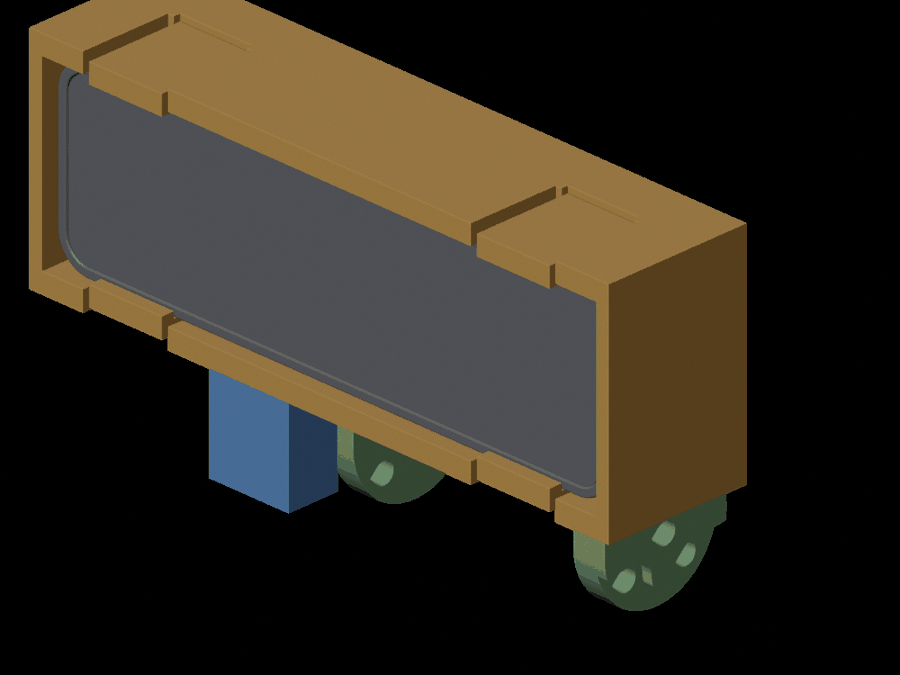
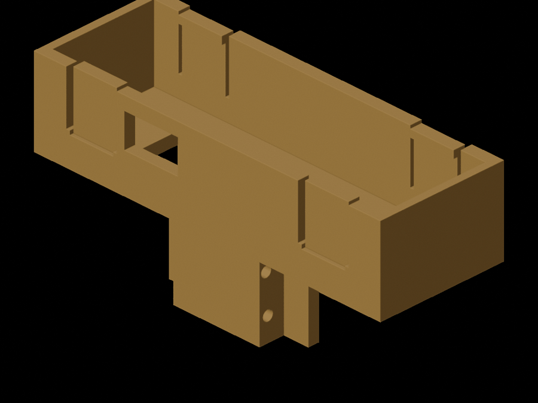

# head/ -- OAK-D Lite on the XLeRobot head

Two printable holders for the OAK-D Lite. **Print `oak_d_lite_slot_cradle.stl`**: it fits the
head the kit ships with and needs no new fasteners. The second part is for the optional
RGBD gimbal from the XLeRobot repository and is kept for whoever has that head.

| File | What it is |
|---|---|
| `oak_d_lite_slot_cradle.stl` | **Print this.** Slots into the stock tilt link in place of the camera connector; the OAK-D Lite clicks into it. 95.5 x 43 x 34 mm, 23.7 cm3 (about 30 g PLA). STL is already in print orientation |
| `oak_d_lite_slot_cradle.step` | Same part as B-rep in the design frame |
| `make_oak_slot_cradle.py` | cadquery source, parameters at the top; writes the STL/STEP and `design_slot_cradle.json` |
| `check_oak_slot_cradle.py` | Fit checks against the stock tilt link and the Luxonis enclosure model; writes `geometry-report-slot-cradle.json` |
| `render_slot_preview.py` | Blender script for the `preview/slot_*.png` pictures |
| `oak_d_lite_pitch_holder.stl` / `.step` | Alternative for the Lix RGBD gimbal (`hardware/step/RGBD_Gimbal`): replaces `Gimbal_Pitch_Holder_d435`, camera on its two VESA M4 threads. `make_oak_holder.py`, `check_oak_holder.py`, `render_preview.py`, `design.json`, `geometry-report.json`, `preview/assembly_*.png`, `preview/holder_*.png` belong to it |
| `source/Gimbal_Pitch_Holder_d435_d415.step` | Upstream RealSense holder the gimbal variant copies its arms from (Apache-2.0) |



## Slot cradle: how it attaches

The kit's head is neck, pan servo, pan bracket, tilt STS3215, then the **tilt link**: a printed
U with the horn discs on its arms and, under its bridge, two feet 7.5 mm wide with a 24 mm slot
between them. The stock camera connector has a tongue in that slot and is held by four M3
screws that go in from the outside of each foot (the feet holes are 3.2 mm with a 5.6 mm
counterbore) into the tongue. The cradle copies exactly that:

* a tongue 23.7 x 20.9 x 9.5 mm with 2.7 mm pilot holes on the feet's hole pattern (two per
  side, 9 mm deep) for the **same four M3 x 10** that hold the current connector, and a 3 mm
  bar under the feet so the weight is carried on the link, not on the screws;
* in front of the link, a box the camera pushes into from the front: 3 mm back wall with a
  60 x 19 mm vent window over the fins, 3 mm ledge and top plate, 2 mm end walls, and four
  snap fingers (12 mm wide, 2 mm thick) whose 1 mm hooks click over the camera's front edge.
  Press the camera in flat; it clicks when the fingers drop behind the front face.

The camera's bottom edge sits 21 mm from the tilt axis, its lens row 40 mm from it, lenses
and both USB-C and the 1/4-20 boss open. The USB-C opening in the ledge is 14.8 x 8.8 mm
and the plug hangs below the camera in front of the link. A right-angle USB-C cable keeps it
short, a straight plug also clears everything in the model.

Everything was measured from the official `XLeRobot_0_3_0.3mf` (object 39 is the tilt link,
object 17 the stock connector) and the Luxonis enclosure STEP; the real printed link may
differ by a few tenths. Clearances are 0.2 mm per side on the tongue and 0.25 mm per side
on the camera. If the tongue is tight, a few strokes of sandpaper; if loose, a strip of tape.

Checks (`geometry-report-slot-cradle.json`): the STL is one watertight shell; zero
intersection between the cradle and the tilt link, between the camera body and the cradle,
and between a straight 20 mm USB-C plug and either; the four M3 shanks pass through the feet
holes without touching the link and land in the pilot holes.



## Printing

The STL is already lying on its front face: camera opening down, tongue standing up. No
supports needed: the ledge, top plate and end walls are vertical, the hooks' entry chamfers are
45 degrees, the tongue is a column. 0.2 mm layers, 4 walls, 30 % infill, PLA or PETG. Check
the four pilot holes with a 2.5 mm drill if the printer closes them.

## Fitting

1. 12 V off. Unscrew the four M3 screws from the outside of the tilt link's feet, pull the
   stock camera connector out of the slot, and unplug the head USB camera.
2. Slide the cradle's tongue into the slot from the front until the wall touches the link,
   put the four M3 x 10 back in through the feet (do not over-tighten, they bite into PLA).
3. Push the OAK-D Lite into the box, lenses up, USB-C down, until the fingers click.
4. Plug the USB-C, route the cable down past the servo and along the neck with slack for the
   full tilt range, then run the head motion check (`farm robot-test --move --ask --only head`)
   with a hand on STOP.

Nothing has been printed or fitted yet. Record the result in `software/STATUS.md`.

## Gimbal variant (not for the stock head)

`oak_d_lite_pitch_holder.stl` is a drop-in for the Lix `Gimbal_Pitch_Holder_d435`: the servo
arms and bridge are the upstream geometry, the RealSense plate is replaced by a 94 x 31 x 5 mm
plate with two 4.4 mm holes on the OAK-D Lite's VESA-75 pattern (M4 x 10 from behind) and a
vent window. Print it flat on the plate's front face. It was checked against the upstream
gimbal assembly CAD (one shell, M4 holes within 0.14 mm of the camera threads, no
camera/holder intersection); the tilt-range sweep in `check_oak_holder.py` is slow and had
not finished when this was written.

## Rebuilding

```sh
cd software/parts/head
uv venv -p 3.12 .venv-cad
uv pip install -p .venv-cad/bin/python cadquery==2.8.0 trimesh manifold3d shapely rtree scipy networkx pillow
.venv-cad/bin/python make_oak_slot_cradle.py
.venv-cad/bin/python check_oak_slot_cradle.py --cache /tmp/oak-holder-cache   # needs <cache>/stock/tilt_link_obj39.stl, see script
/Applications/Blender.app/Contents/MacOS/Blender -b -P render_slot_preview.py -- --cache /tmp/oak-holder-cache
```

The stock link mesh is object 39 of `hardware/XLeRobot_0_3_0.3mf` in the XLeRobot repository
(unzip, parse `3D/3dmodel.model`); it is not committed here.

Sources: Luxonis OAK-D Lite datasheet (Dec 2021, mechanical drawing on page 5) and
`DM9095_enclosure.STL` linked from `luxonis/depthai-hardware`; XLeRobot
`hardware/XLeRobot_0_3_0.3mf` and `hardware/step/RGBD_Gimbal/*.step` (Apache-2.0).
